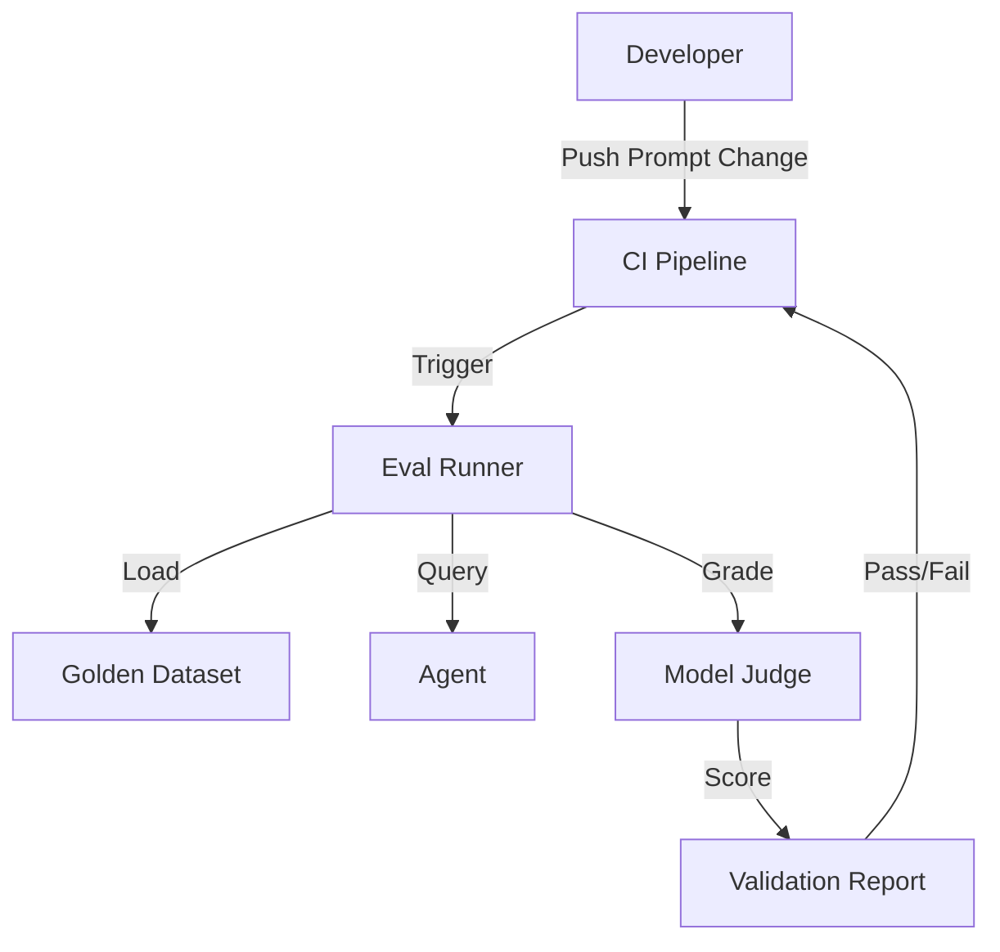

# Agent Validation Guide: Eval-Driven Development

**Evaluation is to Agents what Unit Testing is to Software.**

This guide documents the **Eval-Driven Development (EDD)** process used in this repository to ensure AI agents are reliable, accurate, and safe.

---

## The Problem: "Vibes-Based Testing"

In traditional software, `assert(2 + 2 == 4)` is always true. In AI, "Write a funny poem" yields infinite variations. Developers often rely on "vibes-based testing"—chatting with the bot until it "feels right."

**Why Vibes Fail:**

- **Non-Scalable:** You can't manually chat 1000 times for every prompt change.
- **Subjective:** "Funny" varies by person.
- **Regression-Prone:** Fixing one edge case often breaks another (the "whack-a-mole" problem).

## The Solution: Eval-Driven Development (EDD)

We use **EDD** to systematically measure agent performance against a "Golden Dataset" of inputs and expected outputs.

### Key Concepts

1.  **Golden Dataset:** A JSON file containing test cases (inputs) and ground truth (expected outputs).
2.  **Eval Runner:** A script (`scripts/run-agent-evals.js`) that runs the agent against the dataset.
3.  **Model-Graded Evals:** Using a superior LLM (the "Judge") to grade the response of the agent (the "Candidate").

---

## How to Run Validation

The agent validation process is now integrated into the core validation pipeline.

### 1. Run the Full Suite

The easiest way to validate your agents is to run the standard validation command:

```bash
/validate
```

This command now includes **Phase 5.12: Agent Evaluation**, which automatically:

1.  Loads the golden dataset (`tests/fixtures/golden-dataset-example.json`)
2.  Runs the eval runner (`scripts/run-agent-evals.js`)
3.  Reports pass/fail metrics
4.  Generates a report in `.validation-history/`

### 2. Run Evals Independently

For faster iteration during prompt engineering, run the eval script directly:

```bash
# Run in mock mode (no API costs)
node scripts/run-agent-evals.js --dataset tests/fixtures/golden-dataset-example.json --mock

# Run with real LLM calls (requires API keys)
node scripts/run-agent-evals.js --dataset tests/fixtures/your-dataset.json
```

### 3. Create a Custom Dataset

Create a JSON file (e.g., `tests/fixtures/my-agent-data.json`) with your test cases:

```json
[
  {
    "id": "test-01",
    "input": "Reset my password",
    "expected": "I can help with that. What is your email?",
    "criteria": "contains",
    "context": "User not logged in"
  },
  {
    "id": "test-02",
    "input": "Write a haiku about coding",
    "expected": "structure: 5-7-5 syllables",
    "criteria": "llm-graded"
  }
]
```

---

## Evaluation Criteria Types

The system supports different ways to grade an answer:

| Type             | Description                             | Use Case                                            |
| :--------------- | :-------------------------------------- | :-------------------------------------------------- |
| **`exact`**      | String must match exactly.              | JSON output, specific command strings.              |
| **`contains`**   | Output must contain a substring.        | Checking for keywords or safety warnings.           |
| **`regex`**      | Output must match a regular expression. | Validating formats (emails, dates, IDs).            |
| **`llm-graded`** | An LLM "Judge" scores the answer 0-1.   | Assessing tone, helpfulness, creativity, reasoning. |

---

## The "Agent Validation Pattern" Architecture

This process follows the [Agent Validation Pattern](../STANDARDS/architecture-patterns/agent-validation-pattern.md).



## Related Resources

- **Skill:** [Agent Evaluator](../SKILLS/agent-evaluator/SKILL.md)
- **Standard:** [Eval-Driven Development](../STANDARDS/best-practices/eval-driven-development.md)
- **Pattern:** [Agent Validation Pattern](../STANDARDS/architecture-patterns/agent-validation-pattern.md)
