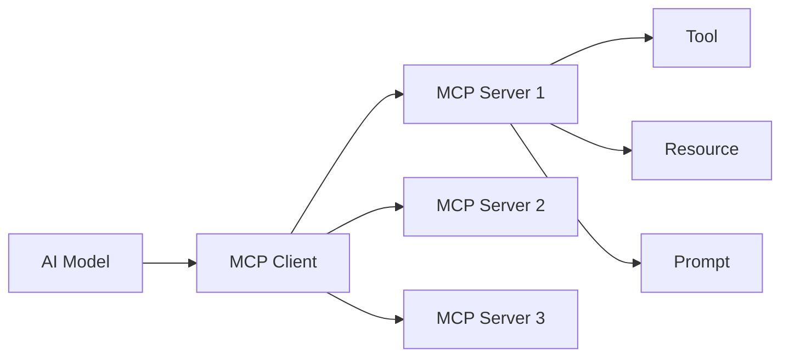

# MCP Development Playbook

Complete guide for creating Model Context Protocol (MCP) servers from scratch using the ai-dev-standards components.

## Table of Contents

1. [Overview](#overview)
2. [MCP Protocol Basics](#mcp-protocol-basics)
3. [Project Setup](#project-setup)
4. [Using Base Components](#using-base-components)
5. [Tool Implementation](#tool-implementation)
6. [Resource Implementation](#resource-implementation)
7. [Prompt Implementation](#prompt-implementation)
8. [Testing](#testing)
9. [Publishing](#publishing)
10. [Registry Addition](#registry-addition)
11. [Common Pitfalls](#common-pitfalls)
12. [Troubleshooting](#troubleshooting)

---

## Overview

Model Context Protocol (MCP) provides a standardized way for AI models to access external tools, resources, and prompts.

### What is MCP?

MCP servers expose three types of capabilities:

- **Tools**: Executable functions the AI can invoke
- **Resources**: Data the AI can read (documents, databases, etc.)
- **Prompts**: Template prompts with variables

### Architecture



---

## MCP Protocol Basics

### Message Format

```typescript
interface MCPRequest {
  method: string
  params?: any
  id?: string | number
}

interface MCPResponse {
  result?: any
  error?: {
    code: number
    message: string
    data?: any
  }
  id?: string | number
}
```

### Core Methods

- `initialize` - Initialize connection
- `tools/list` - List available tools
- `tools/call` - Invoke a tool
- `resources/list` - List available resources
- `resources/read` - Read a resource
- `prompts/list` - List available prompts
- `prompts/get` - Get a prompt

---

## Project Setup

### Create New MCP Server

```bash
mkdir my-mcp-server
cd my-mcp-server
npm init -y

# Install dependencies
npm install zod typescript @types/node

# Copy base components
cp -r /path/to/ai-dev-standards/COMPONENTS/mcp-servers/* ./src/
```

### Project Structure

```
my-mcp-server/
├── src/
│   ├── index.ts              # Main server entry
│   ├── tools/                # Tool implementations
│   │   └── search-tool.ts
│   ├── resources/            # Resource handlers
│   │   └── docs-resource.ts
│   └── prompts/              # Prompt templates
│       └── query-prompt.ts
├── tests/
│   └── server.test.ts
├── package.json
├── tsconfig.json
└── README.md
```

### TypeScript Configuration

```json
{
  "compilerOptions": {
    "target": "ES2020",
    "module": "commonjs",
    "lib": ["ES2020"],
    "outDir": "./dist",
    "rootDir": "./src",
    "strict": true,
    "esModuleInterop": true,
    "skipLibCheck": true,
    "forceConsistentCasingInFileNames": true,
    "resolveJsonModule": true,
    "declaration": true,
    "declarationMap": true
  },
  "include": ["src/**/*"],
  "exclude": ["node_modules", "dist", "tests"]
}
```

---

## Using Base Components

### Extend BaseMCPServer

```typescript
import { BaseMCPServer } from './base-mcp-server'
import { MCPToolHandler } from './mcp-tool-handler'
import { MCPResourceHandler } from './mcp-resource-handler'
import { MCPPromptHandler } from './mcp-prompt-handler'
import { z } from 'zod'

class MyMCPServer extends BaseMCPServer {
  constructor() {
    super({
      name: 'my-mcp-server',
      version: '1.0.0',
      description: 'My custom MCP server for X',
      capabilities: ['tools', 'resources', 'prompts']
    })
  }

  async initialize(): Promise<void> {
    await super.initialize()

    // Register your tools, resources, and prompts
    await this.registerTools()
    await this.registerResources()
    await this.registerPrompts()

    console.log(`${this.config.name} initialized successfully`)
  }

  private async registerTools(): Promise<void> {
    // Will implement in next section
  }

  private async registerResources(): Promise<void> {
    // Will implement in next section
  }

  private async registerPrompts(): Promise<void> {
    // Will implement in next section
  }

  async shutdown(): Promise<void> {
    console.log('Shutting down server...')
    await super.shutdown()
  }
}

// Start server
async function main() {
  const server = new MyMCPServer()
  await server.initialize()

  // Handle graceful shutdown
  process.on('SIGINT', async () => {
    await server.shutdown()
    process.exit(0)
  })
}

main().catch(console.error)
```

---

## Tool Implementation

### Create a Tool Handler

```typescript
// src/tools/search-tool.ts
import { MCPToolHandler } from '../mcp-tool-handler'
import { z } from 'zod'

export function createSearchTool() {
  return new MCPToolHandler({
    name: 'search',
    description: 'Search documents in the knowledge base',
    inputSchema: z.object({
      query: z.string().min(1).max(200).describe('Search query'),
      limit: z.number().int().min(1).max(50).default(10).describe('Number of results'),
      filters: z
        .object({
          category: z.string().optional(),
          dateFrom: z.string().optional(),
          dateTo: z.string().optional()
        })
        .optional()
        .describe('Optional filters')
    }),
    handler: async args => {
      // Implement search logic
      const results = await performSearch(args.query, {
        limit: args.limit,
        filters: args.filters
      })

      return {
        query: args.query,
        results: results.map(r => ({
          id: r.id,
          title: r.title,
          excerpt: r.excerpt,
          score: r.score
        })),
        total: results.length
      }
    },
    // Advanced features
    rateLimits: {
      maxCalls: 100,
      windowMs: 60000 // 100 calls per minute
    },
    cache: {
      enabled: true,
      ttl: 300000 // 5 minutes
    },
    retries: {
      maxAttempts: 3,
      backoffMs: 1000,
      backoffStrategy: 'exponential'
    },
    timeout: 10000 // 10 second timeout
  })
}

async function performSearch(query: string, options: any): Promise<any[]> {
  // Your search implementation
  return []
}
```

### Register Tool in Server

```typescript
class MyMCPServer extends BaseMCPServer {
  private searchTool: MCPToolHandler

  constructor() {
    super({
      /* config */
    })
    this.searchTool = createSearchTool()
  }

  private async registerTools(): Promise<void> {
    // Register tool with server
    this.addTool({
      name: 'search',
      description: 'Search documents',
      inputSchema: z.object({
        query: z.string(),
        limit: z.number().optional()
      }),
      handler: async args => {
        const result = await this.searchTool.execute(args)

        if (!result.success) {
          throw new Error(result.error?.message || 'Search failed')
        }

        return result.data
      }
    })
  }
}
```

### Advanced Tool Patterns

```typescript
// Tool with streaming response
function createStreamingTool() {
  return new MCPToolHandler({
    name: 'generate_report',
    description: 'Generate a detailed report',
    inputSchema: z.object({
      topic: z.string(),
      format: z.enum(['markdown', 'json', 'html'])
    }),
    handler: async args => {
      // Return async generator for streaming
      async function* generate() {
        yield { status: 'started', progress: 0 }

        for (let i = 1; i <= 10; i++) {
          await sleep(1000)
          yield { status: 'processing', progress: i * 10 }
        }

        const report = await generateReport(args.topic, args.format)
        yield { status: 'completed', progress: 100, data: report }
      }

      return generate()
    }
  })
}

// Tool with validation
function createValidatedTool() {
  return new MCPToolHandler({
    name: 'update_user',
    description: 'Update user information',
    inputSchema: z.object({
      userId: z.string().uuid(),
      email: z.string().email().optional(),
      age: z.number().int().min(0).max(150).optional()
    }),
    handler: async args => {
      // Custom validation
      const user = await getUser(args.userId)
      if (!user) {
        throw new Error('User not found')
      }

      if (args.email && args.email === user.email) {
        throw new Error('Email unchanged')
      }

      return updateUser(args.userId, args)
    },
    validation: {
      validateOutput: true,
      outputSchema: z.object({
        id: z.string(),
        email: z.string(),
        updatedAt: z.string()
      })
    }
  })
}
```

---

## Resource Implementation

### Create a Resource Handler

```typescript
// src/resources/docs-resource.ts
import { MCPResourceHandler } from '../mcp-resource-handler'
import fs from 'fs/promises'

export function createDocsResource() {
  return new MCPResourceHandler({
    uri: 'myapp://docs/readme',
    name: 'README Documentation',
    description: 'Application README and getting started guide',
    mimeType: 'text/markdown',
    handler: async version => {
      const filename = version ? `README-${version}.md` : 'README.md'
      return fs.readFile(filename, 'utf-8')
    },
    cache: {
      enabled: true,
      ttl: 600000, // 10 minutes
      maxSize: 10485760 // 10MB
    },
    versioning: {
      enabled: true,
      currentVersion: '1.0.0',
      availableVersions: ['1.0.0', '1.1.0', '2.0.0']
    },
    metadata: {
      tags: ['documentation', 'getting-started'],
      author: 'Engineering Team',
      lastModified: new Date('2024-01-01')
    }
  })
}

// Dynamic resource (API-based)
export function createAPIResource() {
  return new MCPResourceHandler({
    uri: 'myapp://api/status',
    name: 'API Status',
    description: 'Current API health and status',
    mimeType: 'application/json',
    handler: async () => {
      const response = await fetch('https://api.example.com/status')
      return response.json()
    },
    cache: {
      enabled: true,
      ttl: 30000 // 30 seconds
    }
  })
}

// Resource with access control
export function createSecureResource() {
  return new MCPResourceHandler({
    uri: 'myapp://admin/config',
    name: 'Admin Configuration',
    description: 'Sensitive configuration data',
    mimeType: 'application/json',
    handler: async (version, context) => {
      // Check permissions
      if (!context.user?.isAdmin) {
        throw new Error('Access denied: admin privileges required')
      }

      return getAdminConfig()
    },
    accessControl: {
      requiresAuth: true,
      requiredRoles: ['admin']
    }
  })
}
```

### Register Resource in Server

```typescript
class MyMCPServer extends BaseMCPServer {
  private docsResource: MCPResourceHandler

  constructor() {
    super({
      /* config */
    })
    this.docsResource = createDocsResource()
  }

  private async registerResources(): Promise<void> {
    this.addResource({
      uri: 'myapp://docs/readme',
      name: 'README Documentation',
      description: 'Application documentation',
      handler: async options => {
        const result = await this.docsResource.get(options)

        if (!result.success) {
          throw new Error(result.error?.message || 'Failed to read resource')
        }

        return result.content!
      }
    })
  }
}
```

---

## Prompt Implementation

### Create a Prompt Handler

```typescript
// src/prompts/query-prompt.ts
import { MCPPromptHandler } from '../mcp-prompt-handler'

export function createQueryPrompt() {
  return new MCPPromptHandler({
    name: 'search_query',
    description: 'Generate optimized search query',
    template: `You are a search expert. Generate an optimized search query based on:

User Input: {{userInput}}
Context: {{context}}
{{#if filters}}
Filters: {{filters}}
{{/if}}

Generate a concise, effective search query that will return the most relevant results.`,
    variables: {
      userInput: {
        type: 'string',
        required: true,
        description: "User's original search input"
      },
      context: {
        type: 'string',
        required: false,
        default: 'general',
        description: 'Search context or domain'
      },
      filters: {
        type: 'object',
        required: false,
        description: 'Optional search filters'
      }
    },
    validation: {
      maxLength: 2000,
      minLength: 50
    },
    examples: [
      {
        input: {
          userInput: 'how to auth',
          context: 'security'
        },
        output: 'authentication security best practices implementation guide'
      }
    ]
  })
}

// Multi-step prompt
export function createAnalysisPrompt() {
  return new MCPPromptHandler({
    name: 'code_analysis',
    description: 'Multi-step code analysis prompt',
    template: `Analyze the following {{language}} code:

\`\`\`{{language}}
{{code}}
\`\`\`

Please provide:
1. Code quality assessment (1-10)
2. Security vulnerabilities
3. Performance issues
4. Best practice violations
5. Suggested improvements

Focus on: {{focusAreas}}`,
    variables: {
      language: {
        type: 'string',
        required: true,
        enum: ['javascript', 'typescript', 'python', 'java']
      },
      code: {
        type: 'string',
        required: true,
        description: 'Code to analyze'
      },
      focusAreas: {
        type: 'array',
        default: ['security', 'performance', 'maintainability'],
        description: 'Areas to focus analysis on'
      }
    }
  })
}
```

### Register Prompt in Server

```typescript
class MyMCPServer extends BaseMCPServer {
  private queryPrompt: MCPPromptHandler

  constructor() {
    super({
      /* config */
    })
    this.queryPrompt = createQueryPrompt()
  }

  private async registerPrompts(): Promise<void> {
    this.addPrompt({
      name: 'search_query',
      description: 'Generate optimized search query',
      handler: async args => {
        const result = await this.queryPrompt.execute(args)

        if (!result.success) {
          throw new Error(result.error?.message || 'Failed to generate prompt')
        }

        return result.prompt!
      }
    })
  }
}
```

---

## Testing

### Unit Tests

```typescript
import { describe, it, expect, beforeEach } from 'vitest'
import { MyMCPServer } from '../src/index'

describe('MyMCPServer', () => {
  let server: MyMCPServer

  beforeEach(async () => {
    server = new MyMCPServer()
    await server.initialize()
  })

  describe('Tools', () => {
    it('should list available tools', async () => {
      const tools = server.listTools()
      expect(tools).toContainEqual(expect.objectContaining({ name: 'search' }))
    })

    it('should execute search tool', async () => {
      const result = await server.invokeTool('search', {
        query: 'test query',
        limit: 5
      })

      expect(result).toHaveProperty('results')
      expect(result.results).toBeInstanceOf(Array)
    })

    it('should validate tool input', async () => {
      await expect(server.invokeTool('search', { query: '' })).rejects.toThrow(
        'query must be at least 1 character'
      )
    })

    it('should handle tool errors', async () => {
      await expect(server.invokeTool('nonexistent', {})).rejects.toThrow('Tool not found')
    })
  })

  describe('Resources', () => {
    it('should list available resources', async () => {
      const resources = server.listResources()
      expect(resources).toContainEqual(expect.objectContaining({ uri: 'myapp://docs/readme' }))
    })

    it('should read resource', async () => {
      const content = await server.getResource('myapp://docs/readme')
      expect(content).toBeDefined()
      expect(typeof content).toBe('string')
    })

    it('should handle versioned resources', async () => {
      const v1 = await server.getResource('myapp://docs/readme', {
        version: '1.0.0'
      })
      const v2 = await server.getResource('myapp://docs/readme', {
        version: '2.0.0'
      })

      expect(v1).not.toBe(v2)
    })
  })

  describe('Prompts', () => {
    it('should list available prompts', async () => {
      const prompts = server.listPrompts()
      expect(prompts).toContainEqual(expect.objectContaining({ name: 'search_query' }))
    })

    it('should execute prompt', async () => {
      const prompt = await server.executePrompt('search_query', {
        userInput: 'authentication',
        context: 'security'
      })

      expect(prompt).toContain('authentication')
      expect(prompt).toContain('security')
    })
  })
})
```

### Integration Tests

```typescript
describe('MCP Server Integration', () => {
  it('should handle full workflow', async () => {
    const server = new MyMCPServer()
    await server.initialize()

    // 1. Generate query prompt
    const prompt = await server.executePrompt('search_query', {
      userInput: 'best practices'
    })

    // 2. Execute search
    const searchResults = await server.invokeTool('search', {
      query: prompt
    })

    // 3. Read documentation resource
    const docs = await server.getResource('myapp://docs/readme')

    expect(searchResults.results.length).toBeGreaterThan(0)
    expect(docs).toBeDefined()
  })
})
```

---

## Publishing

### Package Configuration

```json
{
  "name": "my-mcp-server",
  "version": "1.0.0",
  "description": "MCP server for X",
  "main": "dist/index.js",
  "types": "dist/index.d.ts",
  "scripts": {
    "build": "tsc",
    "test": "vitest",
    "prepublishOnly": "npm run build && npm test"
  },
  "keywords": ["mcp", "ai", "tools"],
  "author": "Your Name",
  "license": "MIT",
  "files": ["dist", "README.md"]
}
```

### Publish to npm

```bash
# Build
npm run build

# Test
npm test

# Publish
npm publish
```

---

## Registry Addition

### Update MCP Registry

Add your server to `/META/mcp-registry.json`:

```json
{
  "name": "my-mcp-server",
  "version": "1.0.0",
  "description": "MCP server for X",
  "location": "npm:my-mcp-server",
  "capabilities": ["tools", "resources", "prompts"],
  "tools": [
    {
      "name": "search",
      "description": "Search documents"
    }
  ],
  "resources": [
    {
      "uri": "myapp://docs/readme",
      "name": "README Documentation"
    }
  ],
  "prompts": [
    {
      "name": "search_query",
      "description": "Generate search query"
    }
  ],
  "dependencies": [],
  "tags": ["search", "documentation"]
}
```

---

## Common Pitfalls

1. **Not handling errors** → Always wrap in try-catch
2. **No input validation** → Use Zod schemas
3. **Missing rate limiting** → Add rate limits to tools
4. **No caching** → Enable caching for expensive operations
5. **Poor error messages** → Provide clear, actionable errors

---

## Troubleshooting

### Issue: Tool Execution Timeout

**Solution**: Increase timeout or optimize handler

```typescript
const tool = new MCPToolHandler({
  name: 'slow_operation',
  handler: async args => {
    // Your logic
  },
  timeout: 30000 // 30 seconds
})
```

### Issue: Memory Leaks

**Solution**: Clear caches periodically

```typescript
setInterval(() => {
  tool.clearCache()
  resource.clearCache()
}, 3600000) // Every hour
```

---

## Related Resources

### Skills

- multi-agent-architect
- api-designer

### Components

- `/COMPONENTS/mcp-servers/` - All MCP base components

### Registry

- `/META/mcp-registry.json` - MCP server registry

---

**Last Updated**: 2025-10-27
**Version**: 1.0.0
