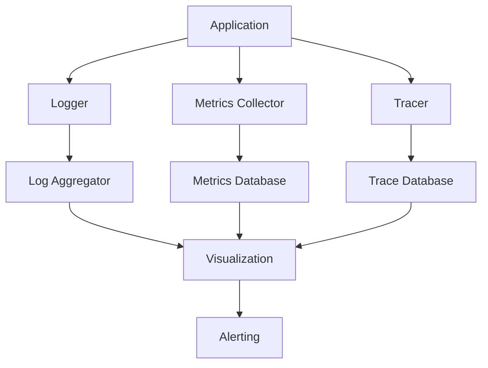

# Monitoring Setup Playbook

Comprehensive guide for implementing observability across your application stack with logging, metrics, tracing, and alerting.

## Table of Contents

1. [Overview](#overview)
2. [Logging Setup](#logging-setup)
3. [Metrics Collection](#metrics-collection)
4. [Distributed Tracing](#distributed-tracing)
5. [Error Tracking](#error-tracking)
6. [Dashboards](#dashboards)
7. [Alerting](#alerting)
8. [Log Aggregation](#log-aggregation)
9. [Integration with Tools](#integration-with-tools)
10. [Common Pitfalls](#common-pitfalls)
11. [Troubleshooting](#troubleshooting)

---

## Overview

Observability is the ability to understand system internal state from external outputs. The three pillars are:

1. **Logs** - Discrete events
2. **Metrics** - Aggregated measurements
3. **Traces** - Request flows through distributed systems

### Observability Stack



---

## Logging Setup

### Structured Logging with Winston

```typescript
import winston from 'winston';

// Create logger
const logger = winston.createLogger({
  level: process.env.LOG_LEVEL || 'info',
  format: winston.format.combine(
    winston.format.timestamp(),
    winston.format.errors({ stack: true }),
    winston.format.json()
  ),
  defaultMeta: {
    service: 'my-service',
    environment: process.env.NODE_ENV
  },
  transports: [
    // Console output
    new winston.transports.Console({
      format: winston.format.combine(
        winston.format.colorize(),
        winston.format.simple()
      )
    }),
    // File output
    new winston.transports.File({
      filename: 'logs/error.log',
      level: 'error'
    }),
    new winston.transports.File({
      filename: 'logs/combined.log'
    })
  ]
});

// Usage
logger.info('User logged in', {
  userId: '123',
  email: 'user@example.com',
  ip: '192.168.1.1'
});

logger.error('Database connection failed', {
  error: new Error('Connection timeout'),
  database: 'postgres',
  host: 'db.example.com'
});
```

### Contextual Logging

```typescript
import { AsyncLocalStorage } from 'async_hooks';

// Create context storage
const requestContext = new AsyncLocalStorage<Map<string, any>>();

// Middleware to create context
app.use((req, res, next) => {
  const store = new Map();
  store.set('requestId', generateRequestId());
  store.set('userId', req.user?.id);
  store.set('path', req.path);

  requestContext.run(store, () => next());
});

// Logger with context
class ContextLogger {
  private logger: winston.Logger;

  constructor(logger: winston.Logger) {
    this.logger = logger;
  }

  private getContext(): Record<string, any> {
    const store = requestContext.getStore();
    if (!store) return {};

    return {
      requestId: store.get('requestId'),
      userId: store.get('userId'),
      path: store.get('path')
    };
  }

  info(message: string, meta?: any): void {
    this.logger.info(message, {
      ...this.getContext(),
      ...meta
    });
  }

  error(message: string, error?: Error, meta?: any): void {
    this.logger.error(message, {
      ...this.getContext(),
      error: error?.message,
      stack: error?.stack,
      ...meta
    });
  }

  warn(message: string, meta?: any): void {
    this.logger.warn(message, {
      ...this.getContext(),
      ...meta
    });
  }
}

// Usage
const log = new ContextLogger(logger);

app.get('/api/users/:id', async (req, res) => {
  log.info('Fetching user');

  try {
    const user = await db.user.findUnique({
      where: { id: req.params.id }
    });

    log.info('User fetched successfully', { userId: user.id });
    res.json(user);
  } catch (error) {
    log.error('Failed to fetch user', error);
    res.status(500).json({ error: 'Internal server error' });
  }
});
```

### Log Levels and Best Practices

```typescript
// Log levels (in order of severity)
// ERROR - Something went wrong, needs immediate attention
// WARN - Something unexpected happened, but system continues
// INFO - General informational messages
// DEBUG - Detailed information for debugging
// TRACE - Very detailed information (function calls, etc.)

// ✅ Good logging practices
logger.info('User authentication successful', {
  userId: user.id,
  method: 'oauth',
  provider: 'google',
  timestamp: new Date().toISOString()
});

logger.error('Database query failed', {
  error: error.message,
  query: sanitizedQuery, // Don't log sensitive data!
  duration: queryTime,
  retries: attemptCount
});

// ❌ Bad logging practices
logger.info('User logged in'); // Not enough context
logger.error(error); // No message or context
logger.debug(JSON.stringify(hugeObject)); // Too much data
logger.info('Password:', user.password); // Logs sensitive data!
```

---

## Metrics Collection

### Prometheus Metrics

```typescript
import prometheus from 'prom-client';

// Create registry
const register = new prometheus.Registry();

// Default metrics (CPU, memory, etc.)
prometheus.collectDefaultMetrics({ register });

// Custom metrics
const httpRequestDuration = new prometheus.Histogram({
  name: 'http_request_duration_seconds',
  help: 'Duration of HTTP requests in seconds',
  labelNames: ['method', 'route', 'status_code'],
  buckets: [0.01, 0.05, 0.1, 0.5, 1, 5]
});

const httpRequestTotal = new prometheus.Counter({
  name: 'http_requests_total',
  help: 'Total number of HTTP requests',
  labelNames: ['method', 'route', 'status_code']
});

const activeConnections = new prometheus.Gauge({
  name: 'active_connections',
  help: 'Number of active connections'
});

const databaseQueryDuration = new prometheus.Summary({
  name: 'database_query_duration_seconds',
  help: 'Database query duration',
  labelNames: ['operation', 'table'],
  percentiles: [0.5, 0.9, 0.95, 0.99]
});

// Register metrics
register.registerMetric(httpRequestDuration);
register.registerMetric(httpRequestTotal);
register.registerMetric(activeConnections);
register.registerMetric(databaseQueryDuration);

// Middleware to track metrics
app.use((req, res, next) => {
  const start = Date.now();

  res.on('finish', () => {
    const duration = (Date.now() - start) / 1000;

    httpRequestDuration
      .labels(req.method, req.route?.path || req.path, res.statusCode.toString())
      .observe(duration);

    httpRequestTotal
      .labels(req.method, req.route?.path || req.path, res.statusCode.toString())
      .inc();
  });

  next();
});

// Metrics endpoint
app.get('/metrics', async (req, res) => {
  res.set('Content-Type', register.contentType);
  res.end(await register.metrics());
});

// Track database queries
async function queryWithMetrics(operation: string, table: string, fn: () => Promise<any>) {
  const end = databaseQueryDuration.startTimer({ operation, table });

  try {
    return await fn();
  } finally {
    end();
  }
}

// Usage
const users = await queryWithMetrics('SELECT', 'users', async () => {
  return db.user.findMany();
});
```

### Business Metrics

```typescript
// Track business-specific metrics
const userRegistrations = new prometheus.Counter({
  name: 'user_registrations_total',
  help: 'Total number of user registrations',
  labelNames: ['source', 'plan']
});

const revenueTotal = new prometheus.Counter({
  name: 'revenue_total',
  help: 'Total revenue in cents',
  labelNames: ['currency', 'product']
});

const subscriptionGauge = new prometheus.Gauge({
  name: 'active_subscriptions',
  help: 'Number of active subscriptions',
  labelNames: ['plan']
});

// Track user registration
app.post('/api/auth/register', async (req, res) => {
  const user = await createUser(req.body);

  userRegistrations.inc({
    source: req.body.source || 'web',
    plan: user.plan
  });

  res.json(user);
});

// Track revenue
app.post('/api/payments', async (req, res) => {
  const payment = await processPayment(req.body);

  revenueTotal.inc({
    currency: payment.currency,
    product: payment.productId
  }, payment.amount);

  res.json(payment);
});

// Update subscription gauge periodically
setInterval(async () => {
  const plans = await db.subscription.groupBy({
    by: ['plan'],
    where: { status: 'active' },
    _count: true
  });

  plans.forEach(({ plan, _count }) => {
    subscriptionGauge.set({ plan }, _count);
  });
}, 60000); // Every minute
```

---

## Distributed Tracing

### OpenTelemetry Setup

```typescript
import { NodeSDK } from '@opentelemetry/sdk-node';
import { getNodeAutoInstrumentations } from '@opentelemetry/auto-instrumentations-node';
import { Resource } from '@opentelemetry/resources';
import { SemanticResourceAttributes } from '@opentelemetry/semantic-conventions';
import { JaegerExporter } from '@opentelemetry/exporter-jaeger';

// Configure SDK
const sdk = new NodeSDK({
  resource: new Resource({
    [SemanticResourceAttributes.SERVICE_NAME]: 'my-service',
    [SemanticResourceAttributes.SERVICE_VERSION]: '1.0.0',
    [SemanticResourceAttributes.DEPLOYMENT_ENVIRONMENT]: process.env.NODE_ENV
  }),
  traceExporter: new JaegerExporter({
    endpoint: 'http://jaeger:14268/api/traces'
  }),
  instrumentations: [
    getNodeAutoInstrumentations({
      '@opentelemetry/instrumentation-fs': { enabled: false }
    })
  ]
});

// Start SDK
sdk.start();

// Manual tracing
import { trace, SpanStatusCode } from '@opentelemetry/api';

const tracer = trace.getTracer('my-service');

async function processOrder(orderId: string) {
  const span = tracer.startSpan('process-order', {
    attributes: {
      'order.id': orderId
    }
  });

  try {
    // Validate order
    const validateSpan = tracer.startSpan('validate-order', {
      parent: span
    });
    await validateOrder(orderId);
    validateSpan.end();

    // Process payment
    const paymentSpan = tracer.startSpan('process-payment', {
      parent: span
    });
    await processPayment(orderId);
    paymentSpan.end();

    // Ship order
    const shipSpan = tracer.startSpan('ship-order', {
      parent: span
    });
    await shipOrder(orderId);
    shipSpan.end();

    span.setStatus({ code: SpanStatusCode.OK });
  } catch (error) {
    span.setStatus({
      code: SpanStatusCode.ERROR,
      message: error.message
    });
    span.recordException(error);
    throw error;
  } finally {
    span.end();
  }
}
```

### Custom Span Attributes

```typescript
import { context, propagation } from '@opentelemetry/api';

// Add span attributes
async function getUserData(userId: string) {
  const span = tracer.startSpan('get-user-data');

  span.setAttributes({
    'user.id': userId,
    'operation': 'read',
    'cache.hit': false
  });

  try {
    // Check cache
    const cached = await redis.get(`user:${userId}`);
    if (cached) {
      span.setAttribute('cache.hit', true);
      return JSON.parse(cached);
    }

    // Fetch from database
    const user = await db.user.findUnique({
      where: { id: userId }
    });

    span.setAttribute('database.query_time_ms', Date.now() - start);

    // Cache result
    await redis.setex(`user:${userId}`, 3600, JSON.stringify(user));

    return user;
  } finally {
    span.end();
  }
}

// Propagate context across services
async function callExternalService(data: any) {
  const headers: Record<string, string> = {};

  // Inject trace context into headers
  propagation.inject(context.active(), headers);

  const response = await fetch('https://api.example.com/endpoint', {
    method: 'POST',
    headers: {
      'Content-Type': 'application/json',
      ...headers // Includes trace context
    },
    body: JSON.stringify(data)
  });

  return response.json();
}
```

---

## Error Tracking

### Sentry Integration

```typescript
import * as Sentry from '@sentry/node';
import { ProfilingIntegration } from '@sentry/profiling-node';

Sentry.init({
  dsn: process.env.SENTRY_DSN,
  environment: process.env.NODE_ENV,
  release: process.env.GIT_COMMIT,
  integrations: [
    new Sentry.Integrations.Http({ tracing: true }),
    new ProfilingIntegration()
  ],
  tracesSampleRate: 0.1, // 10% of requests
  profilesSampleRate: 0.1,
  beforeSend(event, hint) {
    // Filter out specific errors
    if (event.exception?.values?.[0]?.type === 'NotFoundError') {
      return null;
    }

    // Scrub sensitive data
    if (event.request?.data) {
      delete event.request.data.password;
      delete event.request.data.creditCard;
    }

    return event;
  }
});

// Express error handler
app.use(Sentry.Handlers.requestHandler());
app.use(Sentry.Handlers.tracingHandler());

// Routes...

app.use(Sentry.Handlers.errorHandler());

// Manual error capture
app.post('/api/process', async (req, res) => {
  try {
    const result = await processData(req.body);
    res.json(result);
  } catch (error) {
    Sentry.captureException(error, {
      tags: {
        component: 'data-processor'
      },
      contexts: {
        data: {
          inputSize: req.body.length,
          userId: req.user?.id
        }
      },
      level: 'error'
    });

    res.status(500).json({ error: 'Processing failed' });
  }
});

// Set user context
app.use((req, res, next) => {
  if (req.user) {
    Sentry.setUser({
      id: req.user.id,
      email: req.user.email,
      username: req.user.username
    });
  }
  next();
});
```

---

## Dashboards

### Grafana Dashboard Configuration

```json
{
  "dashboard": {
    "title": "Application Overview",
    "panels": [
      {
        "title": "Request Rate",
        "type": "graph",
        "targets": [
          {
            "expr": "rate(http_requests_total[5m])",
            "legendFormat": "{{method}} {{route}}"
          }
        ]
      },
      {
        "title": "Response Time (p95)",
        "type": "graph",
        "targets": [
          {
            "expr": "histogram_quantile(0.95, rate(http_request_duration_seconds_bucket[5m]))"
          }
        ]
      },
      {
        "title": "Error Rate",
        "type": "graph",
        "targets": [
          {
            "expr": "rate(http_requests_total{status_code=~\"5..\"}[5m])"
          }
        ]
      },
      {
        "title": "Active Users",
        "type": "stat",
        "targets": [
          {
            "expr": "active_connections"
          }
        ]
      }
    ]
  }
}
```

---

## Alerting

### Prometheus Alert Rules

```yaml
# alerts.yml
groups:
  - name: application_alerts
    interval: 30s
    rules:
      # High error rate
      - alert: HighErrorRate
        expr: |
          rate(http_requests_total{status_code=~"5.."}[5m]) > 0.05
        for: 5m
        labels:
          severity: critical
        annotations:
          summary: "High error rate detected"
          description: "Error rate is {{ $value | humanizePercentage }} (threshold: 5%)"

      # Slow response time
      - alert: SlowResponseTime
        expr: |
          histogram_quantile(0.95, rate(http_request_duration_seconds_bucket[5m])) > 1
        for: 10m
        labels:
          severity: warning
        annotations:
          summary: "Response time degraded"
          description: "95th percentile response time is {{ $value }}s"

      # Database connection issues
      - alert: DatabaseConnectionPoolExhausted
        expr: |
          database_pool_active_connections / database_pool_max_connections > 0.9
        for: 5m
        labels:
          severity: critical
        annotations:
          summary: "Database connection pool near exhaustion"

      # High memory usage
      - alert: HighMemoryUsage
        expr: |
          process_resident_memory_bytes > 1e9
        for: 10m
        labels:
          severity: warning
        annotations:
          summary: "High memory usage"
          description: "Memory usage is {{ $value | humanize }}B"
```

### PagerDuty Integration

```typescript
import axios from 'axios';

interface PagerDutyEvent {
  severity: 'critical' | 'error' | 'warning' | 'info';
  summary: string;
  source: string;
  component?: string;
  customDetails?: Record<string, any>;
}

class PagerDutyClient {
  private integrationKey: string;

  constructor(integrationKey: string) {
    this.integrationKey = integrationKey;
  }

  async triggerAlert(event: PagerDutyEvent): Promise<void> {
    await axios.post('https://events.pagerduty.com/v2/enqueue', {
      routing_key: this.integrationKey,
      event_action: 'trigger',
      payload: {
        severity: event.severity,
        summary: event.summary,
        source: event.source,
        component: event.component,
        custom_details: event.customDetails
      }
    });
  }

  async resolveAlert(dedupKey: string): Promise<void> {
    await axios.post('https://events.pagerduty.com/v2/enqueue', {
      routing_key: this.integrationKey,
      event_action: 'resolve',
      dedup_key: dedupKey
    });
  }
}

// Usage
const pagerduty = new PagerDutyClient(process.env.PAGERDUTY_KEY!);

// Monitor critical errors
app.use((err, req, res, next) => {
  logger.error('Unhandled error', { error: err });

  if (err.severity === 'critical') {
    pagerduty.triggerAlert({
      severity: 'critical',
      summary: err.message,
      source: 'my-service',
      component: err.component,
      customDetails: {
        route: req.path,
        method: req.method,
        userId: req.user?.id
      }
    });
  }

  res.status(500).json({ error: 'Internal server error' });
});
```

---

## Log Aggregation

### ELK Stack (Elasticsearch, Logstash, Kibana)

```yaml
# docker-compose.yml
version: '3.8'
services:
  elasticsearch:
    image: elasticsearch:8.10.0
    environment:
      - discovery.type=single-node
    ports:
      - "9200:9200"
    volumes:
      - elasticsearch-data:/usr/share/elasticsearch/data

  logstash:
    image: logstash:8.10.0
    volumes:
      - ./logstash.conf:/usr/share/logstash/pipeline/logstash.conf
    ports:
      - "5000:5000"
    depends_on:
      - elasticsearch

  kibana:
    image: kibana:8.10.0
    ports:
      - "5601:5601"
    depends_on:
      - elasticsearch

volumes:
  elasticsearch-data:
```

```conf
# logstash.conf
input {
  tcp {
    port => 5000
    codec => json
  }
}

filter {
  if [type] == "application" {
    mutate {
      add_field => { "indexed_at" => "%{@timestamp}" }
    }
  }
}

output {
  elasticsearch {
    hosts => ["elasticsearch:9200"]
    index => "app-logs-%{+YYYY.MM.dd}"
  }
}
```

---

## Integration with Tools

### Datadog

```typescript
import { StatsD } from 'node-dogstatsd';

const dogstatsd = new StatsD('localhost', 8125);

// Increment counter
dogstatsd.increment('page.views', 1, ['route:/home']);

// Gauge
dogstatsd.gauge('users.online', 1234);

// Histogram
dogstatsd.histogram('request.duration', 245, ['endpoint:/api']);

// Timing
const start = Date.now();
await someOperation();
dogstatsd.timing('operation.duration', Date.now() - start);
```

---

## Common Pitfalls

1. **Logging too much** → Filter and sample logs
2. **No log rotation** → Disk fills up
3. **Missing context** → Add request IDs, user IDs
4. **No alerting** → Set up critical alerts
5. **Ignoring metrics** → Review dashboards regularly

---

## Troubleshooting

### Issue: High Cardinality Metrics

**Problem**: Too many unique label combinations

**Solution**: Limit label values, use exemplars

```typescript
// ❌ Bad: Unbounded labels
httpRequests.inc({ user_id: req.user.id });

// ✅ Good: Bounded labels
httpRequests.inc({ user_type: req.user.type });
```

---

## Related Resources

### Skills
- performance-optimizer
- deployment-advisor

### Tools
- Prometheus
- Grafana
- Jaeger
- Sentry
- Datadog

---

**Last Updated**: 2025-10-27
**Version**: 1.0.0
