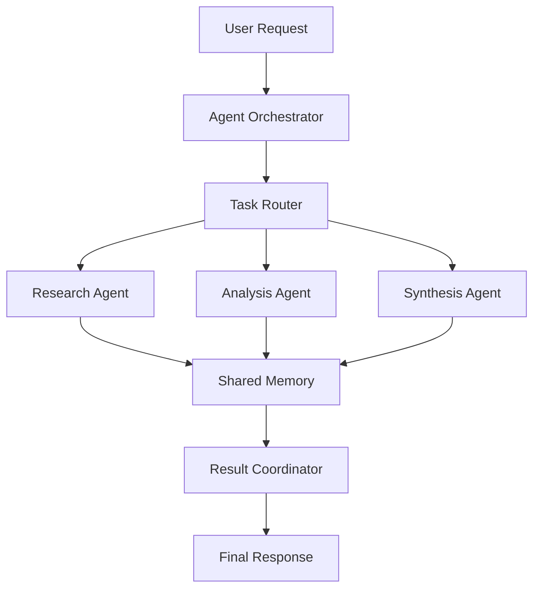
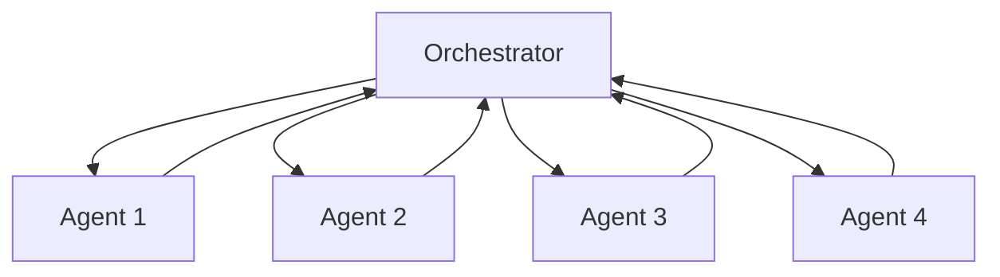
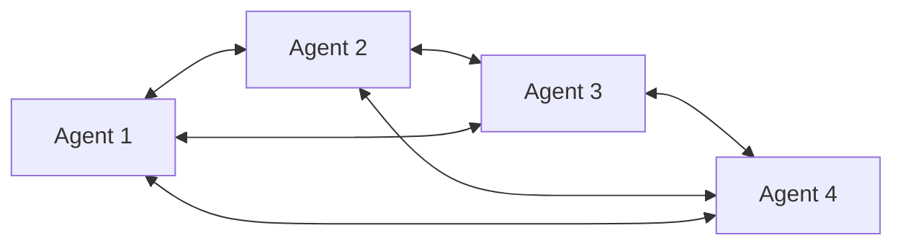
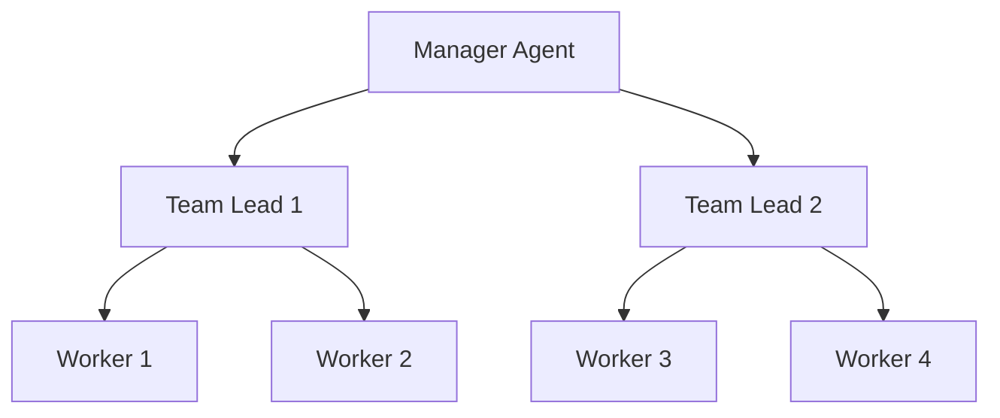
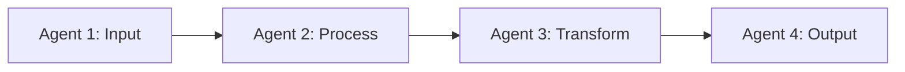

# Multi-Agent Systems Playbook

Comprehensive guide for designing and orchestrating multi-agent systems with advanced coordination patterns.

## Table of Contents

1. [Overview](#overview)
2. [Architecture Patterns](#architecture-patterns)
3. [Agent Communication](#agent-communication)
4. [Task Distribution](#task-distribution)
5. [State Management](#state-management)
6. [Error Handling](#error-handling)
7. [Agent Coordination Examples](#agent-coordination-examples)
8. [Testing Strategies](#testing-strategies)
9. [Production Considerations](#production-considerations)
10. [Common Pitfalls](#common-pitfalls)
11. [Troubleshooting](#troubleshooting)

---

## Overview

Multi-agent systems enable complex problem-solving by distributing tasks across specialized agents that work collaboratively toward a common goal.

### When to Use Multi-Agent Systems

- **Complex problem decomposition**: Tasks requiring multiple specialized skills
- **Parallel processing**: Independent subtasks that can run concurrently
- **Specialized expertise**: Different domains requiring focused knowledge
- **Iterative refinement**: Tasks benefiting from multiple review/revision cycles
- **Scalability**: Systems that need to handle variable workloads

### Key Benefits

- **Specialization**: Each agent focuses on specific tasks
- **Parallelism**: Independent tasks execute simultaneously
- **Modularity**: Easy to add/remove agents without system redesign
- **Fault tolerance**: System continues with degraded capacity if agents fail
- **Flexibility**: Dynamic agent allocation based on workload

### Architecture Overview



---

## Architecture Patterns

### 1. Centralized (Hub-and-Spoke)

Single orchestrator coordinates all agents. Best for simple workflows with clear task boundaries.



**Pros**: Simple, easy to debug, centralized control
**Cons**: Single point of failure, potential bottleneck

```typescript
import { AgentOrchestrator } from './orchestrator'

class CentralizedOrchestrator extends AgentOrchestrator {
  private agents: Map<string, Agent> = new Map()

  async processTask(task: Task): Promise<Result> {
    // 1. Decompose task
    const subtasks = this.decomposeTask(task)

    // 2. Assign to agents
    const assignments = subtasks.map(subtask => ({
      agent: this.selectAgent(subtask),
      subtask
    }))

    // 3. Execute in parallel
    const results = await Promise.all(
      assignments.map(({ agent, subtask }) => agent.execute(subtask))
    )

    // 4. Combine results
    return this.combineResults(results)
  }

  private selectAgent(subtask: Subtask): Agent {
    // Route based on subtask type
    return this.agents.get(subtask.type)!
  }
}
```

### 2. Decentralized (Peer-to-Peer)

Agents communicate directly without central coordinator. Best for dynamic, self-organizing systems.



**Pros**: No single point of failure, highly scalable
**Cons**: Complex coordination, harder to debug

```typescript
class DecentralizedAgent {
  private peers: Map<string, Agent> = new Map()
  private inbox: Queue<Message> = new Queue()

  async processMessage(message: Message): Promise<void> {
    if (message.type === 'task') {
      // Can I handle this?
      if (this.canHandle(message.task)) {
        const result = await this.execute(message.task)
        await this.sendToPeers({ type: 'result', result })
      } else {
        // Forward to suitable peer
        const peer = this.findSuitablePeer(message.task)
        await peer.sendMessage(message)
      }
    } else if (message.type === 'result') {
      await this.handleResult(message.result)
    }
  }

  private findSuitablePeer(task: Task): Agent {
    return Array.from(this.peers.values()).find(peer => peer.canHandle(task))!
  }
}
```

### 3. Hierarchical (Tree Structure)

Multi-level organization with managers coordinating worker agents. Best for complex, structured workflows.



**Pros**: Clear hierarchy, scalable coordination
**Cons**: Multiple points of failure, increased latency

```typescript
class ManagerAgent extends Agent {
  private teamLeads: TeamLeadAgent[] = []

  async processTask(task: Task): Promise<Result> {
    // Decompose into major components
    const components = this.decomposeIntoComponents(task)

    // Assign to team leads
    const teamResults = await Promise.all(
      components.map((component, i) => this.teamLeads[i].processComponent(component))
    )

    // Aggregate results
    return this.aggregateResults(teamResults)
  }
}

class TeamLeadAgent extends Agent {
  private workers: WorkerAgent[] = []

  async processComponent(component: Component): Promise<Result> {
    // Decompose into tasks
    const tasks = this.decomposeIntoTasks(component)

    // Distribute to workers
    const taskResults = await Promise.all(
      tasks.map((task, i) => this.workers[i % this.workers.length].executeTask(task))
    )

    // Combine worker results
    return this.combineResults(taskResults)
  }
}
```

### 4. Pipeline (Sequential)

Linear flow where each agent processes output from previous agent. Best for sequential transformations.



**Pros**: Simple flow, easy to understand
**Cons**: No parallelism, slowest agent becomes bottleneck

```typescript
class PipelineOrchestrator {
  private pipeline: Agent[] = []

  async processThroughPipeline(input: any): Promise<any> {
    let result = input

    for (const agent of this.pipeline) {
      result = await agent.process(result)

      // Validate intermediate results
      if (!this.validateResult(result)) {
        throw new Error(`Agent ${agent.name} produced invalid result`)
      }
    }

    return result
  }

  addStage(agent: Agent): void {
    this.pipeline.push(agent)
  }
}
```

---

## Agent Communication

### Message Formats

```typescript
interface Message {
  id: string
  from: string
  to: string | string[] // Single recipient or broadcast
  type: 'task' | 'result' | 'query' | 'status' | 'error'
  timestamp: number
  payload: any
  metadata?: {
    priority?: 'low' | 'medium' | 'high'
    ttl?: number // Time to live in ms
    correlationId?: string // Link related messages
  }
}

interface TaskMessage extends Message {
  type: 'task'
  payload: {
    task: Task
    context?: any
    deadline?: number
  }
}

interface ResultMessage extends Message {
  type: 'result'
  payload: {
    result: any
    confidence?: number
    metadata?: any
  }
}
```

### Message Broker Implementation

```typescript
class MessageBroker {
  private queues: Map<string, Queue<Message>> = new Map()
  private subscriptions: Map<string, Set<string>> = new Map()
  private messageHandlers: Map<string, (msg: Message) => Promise<void>> = new Map()

  // Publish message to topic
  async publish(topic: string, message: Message): Promise<void> {
    const subscribers = this.subscriptions.get(topic) || new Set()

    await Promise.all(
      Array.from(subscribers).map(async subscriberId => {
        const queue = this.queues.get(subscriberId)
        if (queue) {
          await queue.enqueue(message)
        }
      })
    )
  }

  // Subscribe to topic
  subscribe(topic: string, subscriberId: string): void {
    if (!this.subscriptions.has(topic)) {
      this.subscriptions.set(topic, new Set())
    }
    this.subscriptions.get(topic)!.add(subscriberId)

    if (!this.queues.has(subscriberId)) {
      this.queues.set(subscriberId, new Queue())
    }
  }

  // Register message handler
  onMessage(agentId: string, handler: (msg: Message) => Promise<void>): void {
    this.messageHandlers.set(agentId, handler)
    this.startMessageProcessor(agentId)
  }

  private async startMessageProcessor(agentId: string): Promise<void> {
    const queue = this.queues.get(agentId)
    const handler = this.messageHandlers.get(agentId)

    if (!queue || !handler) return

    while (true) {
      const message = await queue.dequeue()
      if (message) {
        try {
          await handler(message)
        } catch (error) {
          console.error(`Error processing message in ${agentId}:`, error)
        }
      }
    }
  }
}
```

### Direct Communication

```typescript
class Agent {
  private id: string
  private broker: MessageBroker

  async sendMessage(to: string, message: Partial<Message>): Promise<void> {
    await this.broker.publish(to, {
      id: generateId(),
      from: this.id,
      to,
      timestamp: Date.now(),
      ...message
    } as Message)
  }

  async sendTask(to: string, task: Task): Promise<string> {
    const correlationId = generateId()

    await this.sendMessage(to, {
      type: 'task',
      payload: { task },
      metadata: { correlationId }
    })

    return correlationId
  }

  async waitForResult(correlationId: string, timeout: number = 30000): Promise<any> {
    return new Promise((resolve, reject) => {
      const timer = setTimeout(() => {
        reject(new Error('Timeout waiting for result'))
      }, timeout)

      const handler = (message: Message) => {
        if (message.type === 'result' && message.metadata?.correlationId === correlationId) {
          clearTimeout(timer)
          resolve(message.payload.result)
        }
      }

      this.broker.onMessage(this.id, handler)
    })
  }
}
```

---

## Task Distribution

### Load Balancing

```typescript
class LoadBalancer {
  private agents: Map<string, AgentInfo> = new Map()

  // Round-robin distribution
  roundRobin(): Agent {
    const available = Array.from(this.agents.values()).filter(info => info.status === 'idle')

    if (available.length === 0) {
      throw new Error('No available agents')
    }

    return available[this.currentIndex++ % available.length].agent
  }

  // Least connections
  leastConnections(): Agent {
    const available = Array.from(this.agents.values())
      .filter(info => info.status === 'idle')
      .sort((a, b) => a.activeConnections - b.activeConnections)

    if (available.length === 0) {
      throw new Error('No available agents')
    }

    return available[0].agent
  }

  // Weighted distribution (by capability)
  weighted(taskType: string): Agent {
    const capabilities = Array.from(this.agents.values())
      .map(info => ({
        agent: info.agent,
        weight: info.capabilities[taskType] || 0
      }))
      .filter(c => c.weight > 0)

    if (capabilities.length === 0) {
      throw new Error(`No agents capable of ${taskType}`)
    }

    // Select based on weights
    const totalWeight = capabilities.reduce((sum, c) => sum + c.weight, 0)
    let random = Math.random() * totalWeight

    for (const { agent, weight } of capabilities) {
      random -= weight
      if (random <= 0) {
        return agent
      }
    }

    return capabilities[0].agent
  }
}
```

### Task Queue with Priority

```typescript
import { TaskQueue } from '../COMPONENTS/workflows/task-queue'

class PriorityTaskQueue extends TaskQueue {
  private highPriority: Task[] = []
  private normalPriority: Task[] = []
  private lowPriority: Task[] = []

  async enqueue(task: Task): Promise<void> {
    const priority = task.metadata?.priority || 'normal'

    switch (priority) {
      case 'high':
        this.highPriority.push(task)
        break
      case 'low':
        this.lowPriority.push(task)
        break
      default:
        this.normalPriority.push(task)
    }

    await this.processNext()
  }

  async dequeue(): Promise<Task | null> {
    if (this.highPriority.length > 0) {
      return this.highPriority.shift()!
    }
    if (this.normalPriority.length > 0) {
      return this.normalPriority.shift()!
    }
    if (this.lowPriority.length > 0) {
      return this.lowPriority.shift()!
    }
    return null
  }

  getQueueStats(): QueueStats {
    return {
      high: this.highPriority.length,
      normal: this.normalPriority.length,
      low: this.lowPriority.length,
      total: this.highPriority.length + this.normalPriority.length + this.lowPriority.length
    }
  }
}
```

### Work Stealing

```typescript
class WorkStealingScheduler {
  private agentQueues: Map<string, Task[]> = new Map()

  async assignTask(task: Task): Promise<void> {
    // Assign to agent with smallest queue
    const agentId = this.findLightestQueue()
    this.agentQueues.get(agentId)!.push(task)
  }

  async stealWork(idleAgentId: string): Promise<Task | null> {
    // Find agent with most work
    const busiestAgent = this.findBusiestQueue()

    if (!busiestAgent) return null

    const queue = this.agentQueues.get(busiestAgent)!

    // Steal from end (newest tasks)
    if (queue.length > 1) {
      return queue.pop()!
    }

    return null
  }

  private findLightestQueue(): string {
    return Array.from(this.agentQueues.entries()).sort((a, b) => a[1].length - b[1].length)[0][0]
  }

  private findBusiestQueue(): string | null {
    const entries = Array.from(this.agentQueues.entries()).filter(([_, queue]) => queue.length > 1)

    if (entries.length === 0) return null

    return entries.sort((a, b) => b[1].length - a[1].length)[0][0]
  }
}
```

---

## State Management

### Shared Memory

```typescript
class SharedMemory {
  private store: Map<string, any> = new Map()
  private locks: Map<string, boolean> = new Map()
  private subscribers: Map<string, Set<(value: any) => void>> = new Map()

  // Read with optional consistency guarantee
  async read(key: string): Promise<any> {
    return this.store.get(key)
  }

  // Write with locking
  async write(key: string, value: any): Promise<void> {
    await this.acquireLock(key)

    try {
      this.store.set(key, value)
      await this.notifySubscribers(key, value)
    } finally {
      this.releaseLock(key)
    }
  }

  // Atomic update
  async update(key: string, updater: (current: any) => any): Promise<void> {
    await this.acquireLock(key)

    try {
      const current = this.store.get(key)
      const updated = updater(current)
      this.store.set(key, updated)
      await this.notifySubscribers(key, updated)
    } finally {
      this.releaseLock(key)
    }
  }

  // Subscribe to changes
  subscribe(key: string, callback: (value: any) => void): () => void {
    if (!this.subscribers.has(key)) {
      this.subscribers.set(key, new Set())
    }
    this.subscribers.get(key)!.add(callback)

    // Return unsubscribe function
    return () => {
      this.subscribers.get(key)?.delete(callback)
    }
  }

  private async acquireLock(key: string): Promise<void> {
    while (this.locks.get(key)) {
      await new Promise(resolve => setTimeout(resolve, 10))
    }
    this.locks.set(key, true)
  }

  private releaseLock(key: string): void {
    this.locks.set(key, false)
  }

  private async notifySubscribers(key: string, value: any): Promise<void> {
    const callbacks = this.subscribers.get(key)
    if (callbacks) {
      await Promise.all(Array.from(callbacks).map(cb => cb(value)))
    }
  }
}
```

### Distributed State (Redis)

```typescript
import { createClient, RedisClientType } from 'redis'

class DistributedState {
  private client: RedisClientType

  constructor(url: string) {
    this.client = createClient({ url })
  }

  async connect(): Promise<void> {
    await this.client.connect()
  }

  async get(key: string): Promise<any> {
    const value = await this.client.get(key)
    return value ? JSON.parse(value) : null
  }

  async set(key: string, value: any, ttl?: number): Promise<void> {
    const serialized = JSON.stringify(value)
    if (ttl) {
      await this.client.setEx(key, ttl, serialized)
    } else {
      await this.client.set(key, serialized)
    }
  }

  async update(key: string, updater: (current: any) => any): Promise<void> {
    // Use Redis transaction for atomicity
    await this.client.watch(key)

    const current = await this.get(key)
    const updated = updater(current)

    const multi = this.client.multi()
    multi.set(key, JSON.stringify(updated))
    await multi.exec()
  }

  async subscribe(channel: string, handler: (message: any) => void): Promise<void> {
    const subscriber = this.client.duplicate()
    await subscriber.connect()

    await subscriber.subscribe(channel, message => {
      handler(JSON.parse(message))
    })
  }

  async publish(channel: string, message: any): Promise<void> {
    await this.client.publish(channel, JSON.stringify(message))
  }
}
```

---

## Error Handling

### Retry with Exponential Backoff

```typescript
class ResilientAgent extends Agent {
  async executeWithRetry(task: Task, maxAttempts: number = 3): Promise<Result> {
    let lastError: Error

    for (let attempt = 1; attempt <= maxAttempts; attempt++) {
      try {
        return await this.execute(task)
      } catch (error) {
        lastError = error as Error

        if (attempt < maxAttempts) {
          const backoff = Math.pow(2, attempt) * 1000 // Exponential backoff
          console.log(`Attempt ${attempt} failed, retrying in ${backoff}ms`)
          await this.sleep(backoff)
        }
      }
    }

    throw new Error(`Failed after ${maxAttempts} attempts: ${lastError!.message}`)
  }

  private sleep(ms: number): Promise<void> {
    return new Promise(resolve => setTimeout(resolve, ms))
  }
}
```

### Circuit Breaker

```typescript
class CircuitBreaker {
  private failures: number = 0
  private successCount: number = 0
  private state: 'closed' | 'open' | 'half-open' = 'closed'
  private lastFailureTime: number = 0

  constructor(
    private threshold: number = 5,
    private timeout: number = 60000,
    private successThreshold: number = 2
  ) {}

  async execute<T>(fn: () => Promise<T>): Promise<T> {
    if (this.state === 'open') {
      if (Date.now() - this.lastFailureTime > this.timeout) {
        this.state = 'half-open'
        this.successCount = 0
      } else {
        throw new Error('Circuit breaker is OPEN')
      }
    }

    try {
      const result = await fn()
      this.onSuccess()
      return result
    } catch (error) {
      this.onFailure()
      throw error
    }
  }

  private onSuccess(): void {
    this.failures = 0

    if (this.state === 'half-open') {
      this.successCount++
      if (this.successCount >= this.successThreshold) {
        this.state = 'closed'
      }
    }
  }

  private onFailure(): void {
    this.failures++
    this.lastFailureTime = Date.now()

    if (this.failures >= this.threshold) {
      this.state = 'open'
    }
  }

  getState(): string {
    return this.state
  }
}
```

### Graceful Degradation

```typescript
class DegradableOrchestrator {
  private primaryAgents: Agent[] = []
  private fallbackAgents: Agent[] = []

  async processWithFallback(task: Task): Promise<Result> {
    // Try primary agents
    try {
      return await this.processWith(this.primaryAgents, task)
    } catch (error) {
      console.warn('Primary agents failed, trying fallback:', error)

      // Fall back to simpler agents
      try {
        return await this.processWith(this.fallbackAgents, task)
      } catch (fallbackError) {
        // Return partial result or cached result
        return this.getPartialResult(task)
      }
    }
  }

  private async processWith(agents: Agent[], task: Task): Promise<Result> {
    const results = await Promise.all(agents.map(agent => agent.execute(task)))
    return this.combineResults(results)
  }

  private getPartialResult(task: Task): Result {
    // Return cached or default result
    return {
      status: 'partial',
      message: 'Returning cached or partial result due to system degradation'
    }
  }
}
```

---

## Agent Coordination Examples

### Research and Synthesis

```typescript
class ResearchOrchestrator {
  private researchAgent: Agent
  private analysisAgent: Agent
  private synthesisAgent: Agent

  async conductResearch(query: string): Promise<Report> {
    // 1. Research phase
    const researchResults = await this.researchAgent.execute({
      type: 'research',
      query,
      sources: ['web', 'papers', 'docs']
    })

    // 2. Analysis phase
    const analysis = await this.analysisAgent.execute({
      type: 'analyze',
      data: researchResults
    })

    // 3. Synthesis phase
    const report = await this.synthesisAgent.execute({
      type: 'synthesize',
      research: researchResults,
      analysis
    })

    return report
  }
}
```

### Code Review Pipeline

```typescript
class CodeReviewOrchestrator {
  private linterAgent: Agent
  private securityAgent: Agent
  private performanceAgent: Agent
  private summarizer: Agent

  async reviewCode(code: string): Promise<ReviewReport> {
    // Run all reviews in parallel
    const [lintResults, securityResults, perfResults] = await Promise.all([
      this.linterAgent.execute({ type: 'lint', code }),
      this.securityAgent.execute({ type: 'security-scan', code }),
      this.performanceAgent.execute({ type: 'perf-analysis', code })
    ])

    // Summarize findings
    const summary = await this.summarizer.execute({
      type: 'summarize',
      reviews: {
        lint: lintResults,
        security: securityResults,
        performance: perfResults
      }
    })

    return {
      lint: lintResults,
      security: securityResults,
      performance: perfResults,
      summary,
      overallScore: this.calculateScore(lintResults, securityResults, perfResults)
    }
  }
}
```

### Iterative Refinement

```typescript
class IterativeRefinementOrchestrator {
  private generatorAgent: Agent
  private criticAgent: Agent
  private maxIterations: number = 3

  async refineOutput(prompt: string, criteria: any): Promise<Output> {
    let output = await this.generatorAgent.execute({
      type: 'generate',
      prompt
    })

    for (let i = 0; i < this.maxIterations; i++) {
      // Critic reviews output
      const critique = await this.criticAgent.execute({
        type: 'critique',
        output,
        criteria
      })

      // Check if output meets criteria
      if (critique.score >= criteria.threshold) {
        return output
      }

      // Refine based on feedback
      output = await this.generatorAgent.execute({
        type: 'refine',
        output,
        feedback: critique.feedback
      })
    }

    return output // Return best effort after max iterations
  }
}
```

---

## Testing Strategies

### Unit Testing Agents

```typescript
import { describe, it, expect, vi } from 'vitest'

describe('ResearchAgent', () => {
  it('should return relevant research results', async () => {
    const agent = new ResearchAgent({
      apiKey: 'test-key'
    })

    const result = await agent.execute({
      type: 'research',
      query: 'machine learning',
      sources: ['papers']
    })

    expect(result.papers).toBeDefined()
    expect(result.papers.length).toBeGreaterThan(0)
  })

  it('should handle API failures gracefully', async () => {
    const agent = new ResearchAgent({
      apiKey: 'invalid-key'
    })

    await expect(agent.execute({ type: 'research', query: 'test' })).rejects.toThrow(
      'API authentication failed'
    )
  })
})
```

### Integration Testing

```typescript
describe('Multi-Agent Orchestration', () => {
  it('should coordinate research and synthesis', async () => {
    const orchestrator = new ResearchOrchestrator({
      researchAgent: new MockResearchAgent(),
      analysisAgent: new MockAnalysisAgent(),
      synthesisAgent: new MockSynthesisAgent()
    })

    const report = await orchestrator.conductResearch('AI safety')

    expect(report.research).toBeDefined()
    expect(report.analysis).toBeDefined()
    expect(report.synthesis).toBeDefined()
    expect(report.synthesis).toContain('AI safety')
  })
})
```

### Load Testing

```typescript
describe('System Load', () => {
  it('should handle concurrent requests', async () => {
    const orchestrator = new LoadBalancedOrchestrator()

    const requests = Array.from({ length: 100 }, (_, i) => ({
      id: i,
      query: `test query ${i}`
    }))

    const startTime = Date.now()
    const results = await Promise.all(requests.map(req => orchestrator.process(req)))
    const duration = Date.now() - startTime

    expect(results.length).toBe(100)
    expect(duration).toBeLessThan(10000) // Under 10 seconds

    const avgLatency = duration / 100
    console.log(`Average latency: ${avgLatency}ms`)
  })
})
```

---

## Production Considerations

### Monitoring

```typescript
class AgentMonitor {
  private metrics: Map<string, AgentMetrics> = new Map()

  recordExecution(agentId: string, duration: number, success: boolean): void {
    const metrics = this.getOrCreateMetrics(agentId)

    metrics.totalExecutions++
    metrics.totalDuration += duration
    metrics.avgDuration = metrics.totalDuration / metrics.totalExecutions

    if (success) {
      metrics.successCount++
    } else {
      metrics.failureCount++
    }

    metrics.successRate = metrics.successCount / metrics.totalExecutions
  }

  getMetrics(agentId: string): AgentMetrics {
    return this.metrics.get(agentId)!
  }

  getAllMetrics(): Map<string, AgentMetrics> {
    return this.metrics
  }

  private getOrCreateMetrics(agentId: string): AgentMetrics {
    if (!this.metrics.has(agentId)) {
      this.metrics.set(agentId, {
        totalExecutions: 0,
        successCount: 0,
        failureCount: 0,
        totalDuration: 0,
        avgDuration: 0,
        successRate: 0
      })
    }
    return this.metrics.get(agentId)!
  }
}
```

### Scaling

```typescript
// Horizontal scaling with worker pools
class ScalableOrchestrator {
  private workerPool: WorkerPool

  constructor(config: { minWorkers: number; maxWorkers: number }) {
    this.workerPool = new WorkerPool(config)
  }

  async process(task: Task): Promise<Result> {
    // Auto-scale based on queue length
    await this.workerPool.autoScale()

    // Distribute to available worker
    const worker = await this.workerPool.acquireWorker()

    try {
      return await worker.execute(task)
    } finally {
      this.workerPool.releaseWorker(worker)
    }
  }
}
```

---

## Common Pitfalls

### 1. Over-Coordination

**Problem**: Too much communication overhead between agents.

**Solution**: Minimize inter-agent communication; use shared memory for state.

### 2. Tight Coupling

**Problem**: Agents depend on specific implementation details of other agents.

**Solution**: Use well-defined interfaces and message contracts.

### 3. No Fault Tolerance

**Problem**: Single agent failure brings down entire system.

**Solution**: Implement circuit breakers, retries, and fallback agents.

### 4. Poor Load Balancing

**Problem**: Some agents overloaded while others idle.

**Solution**: Implement dynamic load balancing and work stealing.

### 5. Memory Leaks

**Problem**: Shared memory grows unbounded.

**Solution**: Implement TTL, periodic cleanup, and memory limits.

---

## Troubleshooting

### Issue: Deadlocks

**Symptoms**: System hangs with agents waiting for each other.

**Solution**: Implement timeouts and deadlock detection.

```typescript
class DeadlockDetector {
  async detectDeadlock(waitGraph: Map<string, string[]>): Promise<boolean> {
    // Check for cycles in wait graph
    const visited = new Set<string>()
    const stack = new Set<string>()

    for (const node of waitGraph.keys()) {
      if (this.hasCycle(node, waitGraph, visited, stack)) {
        return true
      }
    }

    return false
  }

  private hasCycle(
    node: string,
    graph: Map<string, string[]>,
    visited: Set<string>,
    stack: Set<string>
  ): boolean {
    visited.add(node)
    stack.add(node)

    const neighbors = graph.get(node) || []
    for (const neighbor of neighbors) {
      if (!visited.has(neighbor)) {
        if (this.hasCycle(neighbor, graph, visited, stack)) {
          return true
        }
      } else if (stack.has(neighbor)) {
        return true // Cycle detected
      }
    }

    stack.delete(node)
    return false
  }
}
```

### Issue: High Latency

**Symptoms**: Slow response times.

**Diagnosis**: Profile agent execution times.

**Solution**: Add parallelism, caching, or optimize slow agents.

---

## Related Resources

### Skills

- multi-agent-architect
- agent-orchestrator
- workflow-designer

### MCPs

- agent-orchestrator-mcp
- message-broker-mcp

### Components

- `/COMPONENTS/workflows/task-queue.ts`
- `/COMPONENTS/mcp-servers/base-mcp-server.ts`

---

**Last Updated**: 2025-10-27
**Version**: 1.0.0
