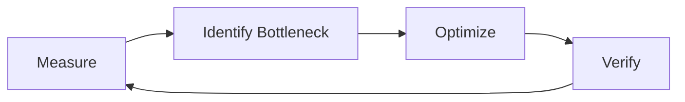

# Performance Optimization Playbook

Comprehensive guide for profiling, tuning, and optimizing application performance across the stack.

## Table of Contents

1. [Overview](#overview)
2. [Performance Profiling Tools](#performance-profiling-tools)
3. [Frontend Optimization](#frontend-optimization)
4. [Backend Optimization](#backend-optimization)
5. [API Optimization](#api-optimization)
6. [Memory Management](#memory-management)
7. [Monitoring & Metrics](#monitoring--metrics)
8. [Common Pitfalls](#common-pitfalls)
9. [Troubleshooting](#troubleshooting)

---

## Overview

Performance optimization is about delivering fast, responsive experiences while efficiently using resources.

### Performance Budget

Set measurable targets:
- **First Contentful Paint (FCP)**: < 1.8s
- **Largest Contentful Paint (LCP)**: < 2.5s
- **Time to Interactive (TTI)**: < 3.8s
- **Total Blocking Time (TBT)**: < 200ms
- **Cumulative Layout Shift (CLS)**: < 0.1
- **API Response Time**: < 200ms (p95)
- **Database Query Time**: < 50ms (p95)

### Optimization Flow



---

## Performance Profiling Tools

### Frontend Profiling

```typescript
// Chrome DevTools Performance API
performance.mark('operation-start');

// Perform operation
await heavyOperation();

performance.mark('operation-end');
performance.measure('operation', 'operation-start', 'operation-end');

// Get measurements
const measurements = performance.getEntriesByType('measure');
console.log('Operation took:', measurements[0].duration, 'ms');

// User Timing API
const observer = new PerformanceObserver((list) => {
  for (const entry of list.getEntries()) {
    console.log(`${entry.name}: ${entry.duration}ms`);
  }
});
observer.observe({ entryTypes: ['measure'] });
```

### Backend Profiling

```typescript
import { performance } from 'perf_hooks';

class Profiler {
  private timings: Map<string, number[]> = new Map();

  start(label: string): () => void {
    const start = performance.now();

    return () => {
      const duration = performance.now() - start;

      if (!this.timings.has(label)) {
        this.timings.set(label, []);
      }
      this.timings.get(label)!.push(duration);
    };
  }

  async profile<T>(label: string, fn: () => Promise<T>): Promise<T> {
    const end = this.start(label);
    try {
      return await fn();
    } finally {
      end();
    }
  }

  getStats(label: string): {
    count: number;
    avg: number;
    min: number;
    max: number;
    p50: number;
    p95: number;
    p99: number;
  } {
    const timings = this.timings.get(label) || [];
    const sorted = [...timings].sort((a, b) => a - b);

    return {
      count: timings.length,
      avg: timings.reduce((a, b) => a + b, 0) / timings.length,
      min: sorted[0],
      max: sorted[sorted.length - 1],
      p50: sorted[Math.floor(sorted.length * 0.5)],
      p95: sorted[Math.floor(sorted.length * 0.95)],
      p99: sorted[Math.floor(sorted.length * 0.99)]
    };
  }

  report(): void {
    for (const [label, _] of this.timings) {
      const stats = this.getStats(label);
      console.log(`\n${label}:`);
      console.log(`  Count: ${stats.count}`);
      console.log(`  Average: ${stats.avg.toFixed(2)}ms`);
      console.log(`  P50: ${stats.p50.toFixed(2)}ms`);
      console.log(`  P95: ${stats.p95.toFixed(2)}ms`);
      console.log(`  P99: ${stats.p99.toFixed(2)}ms`);
    }
  }
}

// Usage
const profiler = new Profiler();

app.use((req, res, next) => {
  const end = profiler.start(`${req.method} ${req.path}`);
  res.on('finish', end);
  next();
});

// Profile specific operations
const result = await profiler.profile('database-query', async () => {
  return db.users.findMany();
});
```

---

## Frontend Optimization

### Bundle Size Optimization

```typescript
// next.config.js
module.exports = {
  // Enable compression
  compress: true,

  // Analyze bundle
  webpack: (config, { isServer }) => {
    if (!isServer) {
      config.optimization.splitChunks = {
        chunks: 'all',
        cacheGroups: {
          default: false,
          vendors: false,
          // Vendor chunk
          vendor: {
            name: 'vendor',
            chunks: 'all',
            test: /node_modules/,
            priority: 20
          },
          // Common chunk
          common: {
            name: 'common',
            minChunks: 2,
            chunks: 'all',
            priority: 10,
            reuseExistingChunk: true,
            enforce: true
          }
        }
      };
    }
    return config;
  }
};
```

### Code Splitting

```typescript
// React lazy loading
import { lazy, Suspense } from 'react';

const HeavyComponent = lazy(() => import('./HeavyComponent'));

function App() {
  return (
    <Suspense fallback={<Loading />}>
      <HeavyComponent />
    </Suspense>
  );
}

// Next.js dynamic import
import dynamic from 'next/dynamic';

const DynamicComponent = dynamic(() => import('./HeavyComponent'), {
  loading: () => <Loading />,
  ssr: false // Disable SSR for client-only components
});

// Route-based code splitting
const routes = [
  {
    path: '/dashboard',
    component: lazy(() => import('./pages/Dashboard'))
  },
  {
    path: '/settings',
    component: lazy(() => import('./pages/Settings'))
  }
];
```

### Image Optimization

```typescript
// Next.js Image component
import Image from 'next/image';

function OptimizedImage() {
  return (
    <Image
      src="/hero.jpg"
      alt="Hero"
      width={1200}
      height={600}
      priority // Load immediately for above-the-fold
      placeholder="blur" // Show blur while loading
      quality={85} // Optimize quality vs size
    />
  );
}

// Responsive images
function ResponsiveImage() {
  return (
    <picture>
      <source
        srcSet="/hero-mobile.webp"
        type="image/webp"
        media="(max-width: 768px)"
      />
      <source
        srcSet="/hero-desktop.webp"
        type="image/webp"
        media="(min-width: 769px)"
      />
      
    </picture>
  );
}
```

### React Performance

```typescript
import { memo, useMemo, useCallback } from 'react';

// Memoize components
const ExpensiveComponent = memo(function ExpensiveComponent({ data }) {
  return <div>{/* Render expensive UI */}</div>;
});

// Memoize calculations
function Component({ items }) {
  const sortedItems = useMemo(() => {
    return items.sort((a, b) => a.value - b.value);
  }, [items]);

  const handleClick = useCallback((id) => {
    console.log('Clicked:', id);
  }, []);

  return (
    <div>
      {sortedItems.map(item => (
        <Item key={item.id} data={item} onClick={handleClick} />
      ))}
    </div>
  );
}

// Virtual scrolling for long lists
import { FixedSizeList } from 'react-window';

function VirtualList({ items }) {
  return (
    <FixedSizeList
      height={600}
      itemCount={items.length}
      itemSize={50}
      width="100%"
    >
      {({ index, style }) => (
        <div style={style}>{items[index].name}</div>
      )}
    </FixedSizeList>
  );
}
```

---

## Backend Optimization

### Database Query Optimization

```typescript
import { PrismaClient } from '@prisma/client';

const prisma = new PrismaClient();

// ❌ N+1 query problem
async function inefficientQuery() {
  const users = await prisma.user.findMany();

  for (const user of users) {
    // This causes N additional queries
    const posts = await prisma.post.findMany({
      where: { userId: user.id }
    });
    console.log(user.name, posts.length);
  }
}

// ✅ Use include/select to fetch relations
async function optimizedQuery() {
  const users = await prisma.user.findMany({
    include: {
      posts: true
    }
  });

  users.forEach(user => {
    console.log(user.name, user.posts.length);
  });
}

// ✅ Select only needed fields
async function selectiveQuery() {
  const users = await prisma.user.findMany({
    select: {
      id: true,
      name: true,
      email: true,
      _count: {
        select: { posts: true }
      }
    }
  });
}

// ✅ Use pagination
async function paginatedQuery(page: number = 1, pageSize: number = 20) {
  const [users, total] = await Promise.all([
    prisma.user.findMany({
      skip: (page - 1) * pageSize,
      take: pageSize,
      orderBy: { createdAt: 'desc' }
    }),
    prisma.user.count()
  ]);

  return {
    users,
    total,
    page,
    pageSize,
    totalPages: Math.ceil(total / pageSize)
  };
}
```

### Caching Strategies

```typescript
import Redis from 'ioredis';

const redis = new Redis(process.env.REDIS_URL);

class CacheService {
  // Simple cache
  async get<T>(key: string): Promise<T | null> {
    const cached = await redis.get(key);
    return cached ? JSON.parse(cached) : null;
  }

  async set(key: string, value: any, ttl: number = 3600): Promise<void> {
    await redis.setex(key, ttl, JSON.stringify(value));
  }

  // Cache-aside pattern
  async getOrSet<T>(
    key: string,
    fetcher: () => Promise<T>,
    ttl: number = 3600
  ): Promise<T> {
    const cached = await this.get<T>(key);
    if (cached) return cached;

    const value = await fetcher();
    await this.set(key, value, ttl);
    return value;
  }

  // Cache with tags for invalidation
  async setWithTags(
    key: string,
    value: any,
    tags: string[],
    ttl: number = 3600
  ): Promise<void> {
    await this.set(key, value, ttl);

    // Store tag associations
    for (const tag of tags) {
      await redis.sadd(`tag:${tag}`, key);
    }
  }

  async invalidateTag(tag: string): Promise<void> {
    const keys = await redis.smembers(`tag:${tag}`);
    if (keys.length > 0) {
      await redis.del(...keys);
    }
    await redis.del(`tag:${tag}`);
  }
}

// Usage
const cache = new CacheService();

app.get('/api/users/:id', async (req, res) => {
  const userId = req.params.id;

  const user = await cache.getOrSet(
    `user:${userId}`,
    async () => {
      return db.user.findUnique({ where: { id: userId } });
    },
    3600 // 1 hour
  );

  res.json(user);
});

// Invalidate on update
app.put('/api/users/:id', async (req, res) => {
  const userId = req.params.id;

  await db.user.update({
    where: { id: userId },
    data: req.body
  });

  await redis.del(`user:${userId}`);

  res.json({ success: true });
});
```

### Connection Pooling

```typescript
import { Pool } from 'pg';

// Configure connection pool
const pool = new Pool({
  host: process.env.DB_HOST,
  port: parseInt(process.env.DB_PORT!),
  database: process.env.DB_NAME,
  user: process.env.DB_USER,
  password: process.env.DB_PASSWORD,
  // Pool configuration
  max: 20, // Maximum connections
  min: 5, // Minimum connections
  idleTimeoutMillis: 30000, // Close idle connections after 30s
  connectionTimeoutMillis: 2000, // Fail fast if no connection available
  ssl: {
    rejectUnauthorized: false
  }
});

// Use connection from pool
async function queryDatabase(sql: string, params: any[]) {
  const client = await pool.connect();
  try {
    return await client.query(sql, params);
  } finally {
    client.release(); // Return to pool
  }
}

// Monitor pool health
pool.on('connect', () => {
  console.log('New client connected to pool');
});

pool.on('error', (err) => {
  console.error('Pool error:', err);
});

// Get pool statistics
setInterval(() => {
  console.log('Pool stats:', {
    total: pool.totalCount,
    idle: pool.idleCount,
    waiting: pool.waitingCount
  });
}, 60000); // Every minute
```

---

## API Optimization

### Response Compression

```typescript
import compression from 'compression';

// Enable gzip compression
app.use(compression({
  level: 6, // Compression level (0-9)
  threshold: 1024, // Only compress if > 1KB
  filter: (req, res) => {
    // Don't compress if client doesn't support it
    if (req.headers['x-no-compression']) {
      return false;
    }
    return compression.filter(req, res);
  }
}));
```

### Request Batching

```typescript
class BatchProcessor<T, R> {
  private queue: Array<{
    input: T;
    resolve: (value: R) => void;
    reject: (error: Error) => void;
  }> = [];
  private timer: NodeJS.Timeout | null = null;

  constructor(
    private processor: (inputs: T[]) => Promise<R[]>,
    private maxBatchSize: number = 100,
    private maxWaitMs: number = 50
  ) {}

  async process(input: T): Promise<R> {
    return new Promise((resolve, reject) => {
      this.queue.push({ input, resolve, reject });

      if (this.queue.length >= this.maxBatchSize) {
        this.flush();
      } else if (!this.timer) {
        this.timer = setTimeout(() => this.flush(), this.maxWaitMs);
      }
    });
  }

  private async flush(): Promise<void> {
    if (this.timer) {
      clearTimeout(this.timer);
      this.timer = null;
    }

    const batch = this.queue.splice(0, this.maxBatchSize);
    if (batch.length === 0) return;

    try {
      const inputs = batch.map(item => item.input);
      const results = await this.processor(inputs);

      batch.forEach((item, i) => {
        item.resolve(results[i]);
      });
    } catch (error) {
      batch.forEach(item => {
        item.reject(error as Error);
      });
    }
  }
}

// Usage: Batch database queries
const userBatcher = new BatchProcessor(
  async (userIds: string[]) => {
    return db.user.findMany({
      where: { id: { in: userIds } }
    });
  },
  100, // Max batch size
  50 // Max wait time (ms)
);

app.get('/api/users/:id', async (req, res) => {
  const user = await userBatcher.process(req.params.id);
  res.json(user);
});
```

### GraphQL DataLoader

```typescript
import DataLoader from 'dataloader';

// Batch and cache user loading
const userLoader = new DataLoader(
  async (userIds: readonly string[]) => {
    const users = await db.user.findMany({
      where: { id: { in: [...userIds] } }
    });

    // Return in same order as input
    const userMap = new Map(users.map(u => [u.id, u]));
    return userIds.map(id => userMap.get(id) || null);
  },
  {
    batch: true,
    cache: true,
    maxBatchSize: 100
  }
);

// GraphQL resolver
const resolvers = {
  Post: {
    author: (post: Post) => {
      return userLoader.load(post.authorId);
    }
  }
};
```

---

## Memory Management

### Memory Leak Detection

```typescript
// Track memory usage
function logMemoryUsage() {
  const usage = process.memoryUsage();
  console.log({
    rss: `${Math.round(usage.rss / 1024 / 1024)}MB`,
    heapTotal: `${Math.round(usage.heapTotal / 1024 / 1024)}MB`,
    heapUsed: `${Math.round(usage.heapUsed / 1024 / 1024)}MB`,
    external: `${Math.round(usage.external / 1024 / 1024)}MB`
  });
}

setInterval(logMemoryUsage, 60000); // Every minute

// Heap snapshot
import v8 from 'v8';
import fs from 'fs';

function takeHeapSnapshot() {
  const filename = `heap-${Date.now()}.heapsnapshot`;
  const snapshot = v8.writeHeapSnapshot(filename);
  console.log('Heap snapshot written to:', snapshot);
}

// Take snapshot on high memory usage
setInterval(() => {
  const usage = process.memoryUsage();
  const heapUsedMB = usage.heapUsed / 1024 / 1024;

  if (heapUsedMB > 500) { // > 500MB
    console.warn('High memory usage detected');
    takeHeapSnapshot();
  }
}, 60000);
```

### Prevent Memory Leaks

```typescript
// ❌ Memory leak: event listener not cleaned up
class LeakyComponent {
  constructor() {
    setInterval(() => {
      // This keeps the component in memory forever
      this.doSomething();
    }, 1000);
  }
}

// ✅ Proper cleanup
class CleanComponent {
  private interval: NodeJS.Timeout | null = null;

  start() {
    this.interval = setInterval(() => {
      this.doSomething();
    }, 1000);
  }

  stop() {
    if (this.interval) {
      clearInterval(this.interval);
      this.interval = null;
    }
  }
}

// ❌ Memory leak: circular reference
function createCircularReference() {
  const obj1: any = {};
  const obj2: any = {};
  obj1.ref = obj2;
  obj2.ref = obj1;
  // obj1 and obj2 will never be garbage collected
}

// ✅ Use WeakMap for circular references
const weakMap = new WeakMap();
function createWeakReference() {
  const obj1 = {};
  const obj2 = {};
  weakMap.set(obj1, obj2);
  // Objects can be garbage collected when no longer needed
}
```

---

## Monitoring & Metrics

### Custom Metrics

```typescript
class MetricsCollector {
  private metrics: Map<string, number[]> = new Map();
  private counters: Map<string, number> = new Map();

  // Record timing
  recordTiming(name: string, duration: number): void {
    if (!this.metrics.has(name)) {
      this.metrics.set(name, []);
    }
    this.metrics.get(name)!.push(duration);
  }

  // Increment counter
  increment(name: string, value: number = 1): void {
    const current = this.counters.get(name) || 0;
    this.counters.set(name, current + value);
  }

  // Get percentiles
  getPercentile(name: string, percentile: number): number {
    const values = this.metrics.get(name) || [];
    if (values.length === 0) return 0;

    const sorted = [...values].sort((a, b) => a - b);
    const index = Math.floor(sorted.length * percentile);
    return sorted[index];
  }

  // Export for Prometheus
  exportPrometheus(): string {
    let output = '';

    // Counters
    for (const [name, value] of this.counters) {
      output += `# TYPE ${name} counter\n`;
      output += `${name} ${value}\n`;
    }

    // Histograms
    for (const [name, _] of this.metrics) {
      output += `# TYPE ${name} histogram\n`;
      output += `${name}_sum ${this.getSum(name)}\n`;
      output += `${name}_count ${this.getCount(name)}\n`;
      output += `${name}{quantile="0.5"} ${this.getPercentile(name, 0.5)}\n`;
      output += `${name}{quantile="0.95"} ${this.getPercentile(name, 0.95)}\n`;
      output += `${name}{quantile="0.99"} ${this.getPercentile(name, 0.99)}\n`;
    }

    return output;
  }

  private getSum(name: string): number {
    const values = this.metrics.get(name) || [];
    return values.reduce((a, b) => a + b, 0);
  }

  private getCount(name: string): number {
    return (this.metrics.get(name) || []).length;
  }
}

// Usage
const metrics = new MetricsCollector();

app.use((req, res, next) => {
  const start = Date.now();
  res.on('finish', () => {
    const duration = Date.now() - start;
    metrics.recordTiming('http_request_duration_ms', duration);
    metrics.increment('http_requests_total');
  });
  next();
});

// Metrics endpoint
app.get('/metrics', (req, res) => {
  res.set('Content-Type', 'text/plain');
  res.send(metrics.exportPrometheus());
});
```

---

## Common Pitfalls

1. **Premature optimization** → Profile first, optimize bottlenecks
2. **Not measuring impact** → Always benchmark before and after
3. **Over-caching** → Can cause stale data issues
4. **Ignoring memory leaks** → Monitor memory usage
5. **Not using indexes** → Database queries become slow
6. **Blocking event loop** → Use async operations

---

## Troubleshooting

### Issue: Slow API Response

**Diagnosis**:
```typescript
// Add timing middleware
app.use((req, res, next) => {
  const timings: any = {};

  const originalSend = res.send;
  res.send = function(data) {
    res.setHeader('X-Response-Time', `${Date.now() - req.startTime}ms`);
    res.setHeader('X-Timings', JSON.stringify(timings));
    return originalSend.call(this, data);
  };

  req.startTime = Date.now();
  req.timings = timings;
  next();
});
```

**Solution**: Identify slow operation, add caching/optimization

### Issue: High Memory Usage

**Diagnosis**: Take heap snapshot, analyze with Chrome DevTools

**Solution**: Fix memory leaks, optimize data structures

---

## Related Resources

### Skills
- performance-optimizer
- backend-engineer

### MCPs
- performance-profiler-mcp
- monitoring-mcp

---

**Last Updated**: 2025-10-27
**Version**: 1.0.0
