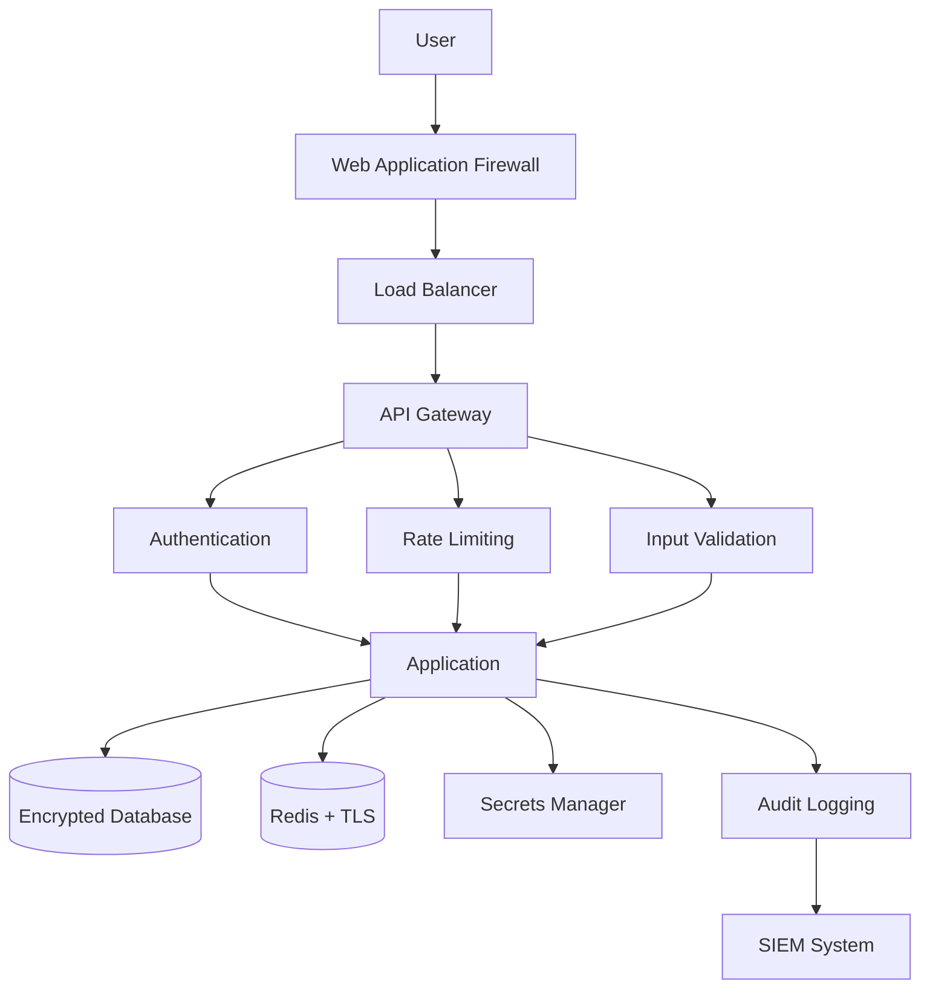

# Security Hardening Playbook

Comprehensive guide for implementing security best practices across your application stack.

## Table of Contents

1. [Overview](#overview)
2. [Authentication & Authorization](#authentication--authorization)
3. [Input Validation](#input-validation)
4. [SQL Injection Prevention](#sql-injection-prevention)
5. [XSS Prevention](#xss-prevention)
6. [CSRF Protection](#csrf-protection)
7. [API Security](#api-security)
8. [Secrets Management](#secrets-management)
9. [Dependency Security](#dependency-security)
10. [Container Security](#container-security)
11. [Network Security](#network-security)
12. [Security Headers](#security-headers)
13. [Audit Logging](#audit-logging)
14. [Incident Response](#incident-response)
15. [Common Pitfalls](#common-pitfalls)
16. [Troubleshooting](#troubleshooting)

---

## Overview

Security hardening is a continuous process of reducing attack surface and implementing defense-in-depth strategies.

### OWASP Top 10 Coverage

This playbook addresses all OWASP Top 10 vulnerabilities:

1. **A01:2021 – Broken Access Control**
2. **A02:2021 – Cryptographic Failures**
3. **A03:2021 – Injection**
4. **A04:2021 – Insecure Design**
5. **A05:2021 – Security Misconfiguration**
6. **A06:2021 – Vulnerable and Outdated Components**
7. **A07:2021 – Identification and Authentication Failures**
8. **A08:2021 – Software and Data Integrity Failures**
9. **A09:2021 – Security Logging and Monitoring Failures**
10. **A10:2021 – Server-Side Request Forgery (SSRF)**

### Security Architecture



---

## Authentication & Authorization

### JWT-Based Authentication

```typescript
import jwt from 'jsonwebtoken';
import bcrypt from 'bcrypt';

interface User {
  id: string;
  email: string;
  passwordHash: string;
  roles: string[];
}

interface JWTPayload {
  userId: string;
  email: string;
  roles: string[];
}

class AuthService {
  private readonly JWT_SECRET = process.env.JWT_SECRET!;
  private readonly JWT_EXPIRY = '1h';
  private readonly REFRESH_TOKEN_EXPIRY = '7d';
  private readonly SALT_ROUNDS = 12;

  // Hash password
  async hashPassword(password: string): Promise<string> {
    return bcrypt.hash(password, this.SALT_ROUNDS);
  }

  // Verify password
  async verifyPassword(password: string, hash: string): Promise<boolean> {
    return bcrypt.compare(password, hash);
  }

  // Generate access token
  generateAccessToken(user: User): string {
    const payload: JWTPayload = {
      userId: user.id,
      email: user.email,
      roles: user.roles
    };

    return jwt.sign(payload, this.JWT_SECRET, {
      expiresIn: this.JWT_EXPIRY,
      algorithm: 'HS256',
      issuer: 'your-app',
      audience: 'your-app-api'
    });
  }

  // Generate refresh token
  generateRefreshToken(user: User): string {
    return jwt.sign(
      { userId: user.id },
      this.JWT_SECRET,
      { expiresIn: this.REFRESH_TOKEN_EXPIRY }
    );
  }

  // Verify token
  verifyToken(token: string): JWTPayload {
    try {
      return jwt.verify(token, this.JWT_SECRET, {
        algorithms: ['HS256'],
        issuer: 'your-app',
        audience: 'your-app-api'
      }) as JWTPayload;
    } catch (error) {
      throw new Error('Invalid or expired token');
    }
  }

  // Refresh access token
  async refreshAccessToken(refreshToken: string): Promise<string> {
    const payload = this.verifyToken(refreshToken);
    const user = await this.getUserById(payload.userId);

    if (!user) {
      throw new Error('User not found');
    }

    return this.generateAccessToken(user);
  }

  private async getUserById(id: string): Promise<User | null> {
    // Implement database lookup
    return null;
  }
}
```

### Role-Based Access Control (RBAC)

```typescript
enum Permission {
  READ = 'read',
  WRITE = 'write',
  DELETE = 'delete',
  ADMIN = 'admin'
}

interface Role {
  name: string;
  permissions: Permission[];
}

class RBACService {
  private roles: Map<string, Role> = new Map([
    ['user', { name: 'user', permissions: [Permission.READ] }],
    ['editor', { name: 'editor', permissions: [Permission.READ, Permission.WRITE] }],
    ['admin', { name: 'admin', permissions: [Permission.READ, Permission.WRITE, Permission.DELETE, Permission.ADMIN] }]
  ]);

  hasPermission(userRoles: string[], requiredPermission: Permission): boolean {
    for (const roleName of userRoles) {
      const role = this.roles.get(roleName);
      if (role && role.permissions.includes(requiredPermission)) {
        return true;
      }
    }
    return false;
  }

  // Express middleware
  requirePermission(permission: Permission) {
    return (req: any, res: any, next: any) => {
      const user = req.user; // Set by auth middleware

      if (!user) {
        return res.status(401).json({ error: 'Unauthorized' });
      }

      if (!this.hasPermission(user.roles, permission)) {
        return res.status(403).json({ error: 'Forbidden' });
      }

      next();
    };
  }
}

// Usage
const rbac = new RBACService();

app.delete('/api/users/:id',
  authMiddleware,
  rbac.requirePermission(Permission.DELETE),
  deleteUserHandler
);
```

### OAuth 2.0 Implementation

```typescript
import { google } from 'googleapis';

class OAuth2Service {
  private oauth2Client: any;

  constructor() {
    this.oauth2Client = new google.auth.OAuth2(
      process.env.GOOGLE_CLIENT_ID,
      process.env.GOOGLE_CLIENT_SECRET,
      process.env.GOOGLE_REDIRECT_URI
    );
  }

  // Generate authorization URL
  getAuthorizationUrl(): string {
    return this.oauth2Client.generateAuthUrl({
      access_type: 'offline',
      scope: [
        'https://www.googleapis.com/auth/userinfo.email',
        'https://www.googleapis.com/auth/userinfo.profile'
      ],
      state: this.generateState() // CSRF protection
    });
  }

  // Exchange code for tokens
  async getTokens(code: string): Promise<any> {
    const { tokens } = await this.oauth2Client.getToken(code);
    return tokens;
  }

  // Get user info
  async getUserInfo(accessToken: string): Promise<any> {
    this.oauth2Client.setCredentials({ access_token: accessToken });

    const oauth2 = google.oauth2({ version: 'v2', auth: this.oauth2Client });
    const { data } = await oauth2.userinfo.get();

    return data;
  }

  private generateState(): string {
    return crypto.randomBytes(32).toString('hex');
  }
}
```

### Multi-Factor Authentication (MFA)

```typescript
import speakeasy from 'speakeasy';
import QRCode from 'qrcode';

class MFAService {
  // Generate secret for user
  generateSecret(email: string): { secret: string; qrCode: string } {
    const secret = speakeasy.generateSecret({
      name: `YourApp (${email})`,
      issuer: 'YourApp'
    });

    return {
      secret: secret.base32,
      qrCode: secret.otpauth_url!
    };
  }

  // Generate QR code image
  async generateQRCode(otpauthUrl: string): Promise<string> {
    return QRCode.toDataURL(otpauthUrl);
  }

  // Verify token
  verifyToken(secret: string, token: string): boolean {
    return speakeasy.totp.verify({
      secret,
      encoding: 'base32',
      token,
      window: 2 // Allow 2 time steps before/after
    });
  }

  // Express middleware
  requireMFA() {
    return async (req: any, res: any, next: any) => {
      const user = req.user;
      const mfaToken = req.headers['x-mfa-token'];

      if (!user.mfaEnabled) {
        return next();
      }

      if (!mfaToken) {
        return res.status(401).json({ error: 'MFA token required' });
      }

      const isValid = this.verifyToken(user.mfaSecret, mfaToken);

      if (!isValid) {
        return res.status(401).json({ error: 'Invalid MFA token' });
      }

      next();
    };
  }
}
```

---

## Input Validation

### Schema Validation with Zod

```typescript
import { z } from 'zod';

// Define schemas
const UserSchema = z.object({
  email: z.string().email().max(255),
  password: z.string()
    .min(8, 'Password must be at least 8 characters')
    .max(128)
    .regex(/[A-Z]/, 'Password must contain uppercase letter')
    .regex(/[a-z]/, 'Password must contain lowercase letter')
    .regex(/[0-9]/, 'Password must contain number')
    .regex(/[^A-Za-z0-9]/, 'Password must contain special character'),
  name: z.string().min(1).max(100),
  age: z.number().int().min(13).max(120).optional(),
  roles: z.array(z.enum(['user', 'editor', 'admin'])).default(['user'])
});

const QuerySchema = z.object({
  page: z.coerce.number().int().min(1).default(1),
  limit: z.coerce.number().int().min(1).max(100).default(10),
  search: z.string().max(200).optional(),
  sortBy: z.enum(['name', 'createdAt', 'updatedAt']).default('createdAt'),
  order: z.enum(['asc', 'desc']).default('desc')
});

// Validation middleware
function validateBody(schema: z.ZodSchema) {
  return (req: any, res: any, next: any) => {
    try {
      req.body = schema.parse(req.body);
      next();
    } catch (error) {
      if (error instanceof z.ZodError) {
        return res.status(400).json({
          error: 'Validation failed',
          details: error.errors
        });
      }
      next(error);
    }
  };
}

function validateQuery(schema: z.ZodSchema) {
  return (req: any, res: any, next: any) => {
    try {
      req.query = schema.parse(req.query);
      next();
    } catch (error) {
      if (error instanceof z.ZodError) {
        return res.status(400).json({
          error: 'Invalid query parameters',
          details: error.errors
        });
      }
      next(error);
    }
  };
}

// Usage
app.post('/api/users',
  validateBody(UserSchema),
  createUserHandler
);

app.get('/api/users',
  validateQuery(QuerySchema),
  getUsersHandler
);
```

### Sanitization

```typescript
import DOMPurify from 'isomorphic-dompurify';
import validator from 'validator';

class InputSanitizer {
  // Sanitize HTML
  sanitizeHTML(input: string): string {
    return DOMPurify.sanitize(input, {
      ALLOWED_TAGS: ['b', 'i', 'em', 'strong', 'a', 'p', 'br'],
      ALLOWED_ATTR: ['href']
    });
  }

  // Escape SQL
  escapeSQLString(input: string): string {
    return input.replace(/'/g, "''");
  }

  // Sanitize filename
  sanitizeFilename(filename: string): string {
    return filename.replace(/[^a-zA-Z0-9.-]/g, '_');
  }

  // Validate and sanitize URL
  sanitizeURL(url: string): string | null {
    if (!validator.isURL(url, {
      protocols: ['http', 'https'],
      require_protocol: true
    })) {
      return null;
    }

    try {
      const parsed = new URL(url);

      // Block internal IPs (SSRF prevention)
      if (this.isInternalIP(parsed.hostname)) {
        return null;
      }

      return url;
    } catch {
      return null;
    }
  }

  private isInternalIP(hostname: string): boolean {
    const internalPatterns = [
      /^127\./,
      /^10\./,
      /^172\.(1[6-9]|2[0-9]|3[0-1])\./,
      /^192\.168\./,
      /^localhost$/i,
      /^0\.0\.0\.0$/
    ];

    return internalPatterns.some(pattern => pattern.test(hostname));
  }
}
```

---

## SQL Injection Prevention

### Parameterized Queries

```typescript
import { Pool } from 'pg';

class SecureDatabase {
  private pool: Pool;

  constructor() {
    this.pool = new Pool({
      connectionString: process.env.DATABASE_URL,
      ssl: { rejectUnauthorized: true },
      max: 20,
      idleTimeoutMillis: 30000
    });
  }

  // CORRECT: Parameterized query
  async getUserByEmail(email: string): Promise<any> {
    const query = 'SELECT * FROM users WHERE email = $1';
    const result = await this.pool.query(query, [email]);
    return result.rows[0];
  }

  // CORRECT: Multiple parameters
  async searchUsers(name: string, minAge: number): Promise<any[]> {
    const query = `
      SELECT id, email, name, age
      FROM users
      WHERE name ILIKE $1 AND age >= $2
      ORDER BY created_at DESC
    `;
    const result = await this.pool.query(query, [`%${name}%`, minAge]);
    return result.rows;
  }

  // WRONG: String concatenation (DO NOT DO THIS)
  async unsafeQuery(email: string): Promise<any> {
    // ❌ VULNERABLE TO SQL INJECTION
    const query = `SELECT * FROM users WHERE email = '${email}'`;
    const result = await this.pool.query(query);
    return result.rows[0];
  }
}
```

### ORM Usage (Prisma)

```typescript
import { PrismaClient } from '@prisma/client';

const prisma = new PrismaClient();

// Prisma automatically uses parameterized queries
async function secureUserQueries() {
  // Find user by email
  const user = await prisma.user.findUnique({
    where: { email: 'user@example.com' }
  });

  // Search with filters
  const users = await prisma.user.findMany({
    where: {
      name: { contains: 'John', mode: 'insensitive' },
      age: { gte: 18 }
    },
    select: {
      id: true,
      email: true,
      name: true
    }
  });

  // Update with transaction
  await prisma.$transaction([
    prisma.user.update({
      where: { id: userId },
      data: { lastLogin: new Date() }
    }),
    prisma.auditLog.create({
      data: {
        action: 'LOGIN',
        userId,
        timestamp: new Date()
      }
    })
  ]);
}
```

---

## XSS Prevention

### Content Security Policy

```typescript
import helmet from 'helmet';

app.use(helmet.contentSecurityPolicy({
  directives: {
    defaultSrc: ["'self'"],
    scriptSrc: [
      "'self'",
      "'sha256-...'", // Specific inline script hash
      "https://cdn.example.com"
    ],
    styleSrc: [
      "'self'",
      "'unsafe-inline'", // Required for some CSS-in-JS
      "https://fonts.googleapis.com"
    ],
    imgSrc: ["'self'", "data:", "https:"],
    fontSrc: ["'self'", "https://fonts.gstatic.com"],
    connectSrc: ["'self'", "https://api.example.com"],
    frameSrc: ["'none'"],
    objectSrc: ["'none'"],
    upgradeInsecureRequests: []
  }
}));
```

### Output Encoding

```typescript
class XSSProtection {
  // HTML encode
  encodeHTML(str: string): string {
    return str
      .replace(/&/g, '&amp;')
      .replace(/</g, '&lt;')
      .replace(/>/g, '&gt;')
      .replace(/"/g, '&quot;')
      .replace(/'/g, '&#x27;')
      .replace(/\//g, '&#x2F;');
  }

  // JavaScript encode
  encodeJS(str: string): string {
    return str
      .replace(/\\/g, '\\\\')
      .replace(/'/g, "\\'")
      .replace(/"/g, '\\"')
      .replace(/\n/g, '\\n')
      .replace(/\r/g, '\\r')
      .replace(/</g, '\\x3c')
      .replace(/>/g, '\\x3e');
  }

  // URL encode
  encodeURL(str: string): string {
    return encodeURIComponent(str);
  }
}

// React automatically escapes JSX
function SafeComponent({ userInput }: { userInput: string }) {
  // Safe: React escapes by default
  return <div>{userInput}</div>;

  // Unsafe: dangerouslySetInnerHTML bypasses escaping
  // ❌ DO NOT DO THIS unless HTML is sanitized
  // return <div dangerouslySetInnerHTML={{ __html: userInput }} />;
}
```

---

## CSRF Protection

### Token-Based CSRF Protection

```typescript
import csrf from 'csurf';
import cookieParser from 'cookie-parser';

// Setup CSRF protection
app.use(cookieParser());
app.use(csrf({ cookie: true }));

// Middleware to attach token to response
app.use((req, res, next) => {
  res.locals.csrfToken = req.csrfToken();
  next();
});

// HTML form
app.get('/form', (req, res) => {
  res.send(`
    <form action="/submit" method="POST">
      <input type="hidden" name="_csrf" value="${res.locals.csrfToken}">
      <input type="text" name="data">
      <button type="submit">Submit</button>
    </form>
  `);
});

// API endpoint
app.get('/api/csrf-token', (req, res) => {
  res.json({ csrfToken: req.csrfToken() });
});

// Frontend usage
async function makeSecureRequest(data: any) {
  // Get CSRF token
  const tokenResponse = await fetch('/api/csrf-token');
  const { csrfToken } = await tokenResponse.json();

  // Include in request
  const response = await fetch('/api/data', {
    method: 'POST',
    headers: {
      'Content-Type': 'application/json',
      'X-CSRF-Token': csrfToken
    },
    body: JSON.stringify(data)
  });

  return response.json();
}
```

### SameSite Cookies

```typescript
import session from 'express-session';

app.use(session({
  secret: process.env.SESSION_SECRET!,
  resave: false,
  saveUninitialized: false,
  cookie: {
    secure: true, // HTTPS only
    httpOnly: true, // No JavaScript access
    sameSite: 'strict', // Strict CSRF protection
    maxAge: 3600000 // 1 hour
  }
}));
```

---

## API Security

### Rate Limiting

```typescript
import rateLimit from 'express-rate-limit';
import RedisStore from 'rate-limit-redis';
import Redis from 'ioredis';

const redis = new Redis(process.env.REDIS_URL);

// Global rate limiter
const globalLimiter = rateLimit({
  store: new RedisStore({
    client: redis,
    prefix: 'rl:global:'
  }),
  windowMs: 15 * 60 * 1000, // 15 minutes
  max: 100, // 100 requests per window
  message: 'Too many requests, please try again later',
  standardHeaders: true,
  legacyHeaders: false
});

// Strict limiter for auth endpoints
const authLimiter = rateLimit({
  store: new RedisStore({
    client: redis,
    prefix: 'rl:auth:'
  }),
  windowMs: 15 * 60 * 1000,
  max: 5, // Only 5 login attempts per 15 minutes
  skipSuccessfulRequests: true
});

// Per-user rate limiter
const perUserLimiter = rateLimit({
  store: new RedisStore({
    client: redis,
    prefix: 'rl:user:'
  }),
  windowMs: 60 * 1000, // 1 minute
  max: 30,
  keyGenerator: (req) => req.user?.id || req.ip
});

app.use('/api/', globalLimiter);
app.post('/api/auth/login', authLimiter, loginHandler);
app.use('/api/user/', perUserLimiter);
```

### API Key Management

```typescript
import crypto from 'crypto';

class APIKeyService {
  // Generate API key
  generateAPIKey(): { key: string; hash: string } {
    const key = `sk_${crypto.randomBytes(32).toString('hex')}`;
    const hash = this.hashAPIKey(key);
    return { key, hash };
  }

  // Hash API key for storage
  private hashAPIKey(key: string): string {
    return crypto
      .createHash('sha256')
      .update(key)
      .digest('hex');
  }

  // Verify API key
  async verifyAPIKey(providedKey: string): Promise<boolean> {
    const hash = this.hashAPIKey(providedKey);

    // Look up hash in database
    const apiKey = await this.getAPIKeyByHash(hash);

    if (!apiKey) {
      return false;
    }

    // Check if expired
    if (apiKey.expiresAt && apiKey.expiresAt < new Date()) {
      return false;
    }

    // Update last used
    await this.updateLastUsed(apiKey.id);

    return true;
  }

  // Express middleware
  requireAPIKey() {
    return async (req: any, res: any, next: any) => {
      const apiKey = req.headers['x-api-key'];

      if (!apiKey) {
        return res.status(401).json({ error: 'API key required' });
      }

      const isValid = await this.verifyAPIKey(apiKey);

      if (!isValid) {
        return res.status(401).json({ error: 'Invalid API key' });
      }

      next();
    };
  }

  private async getAPIKeyByHash(hash: string): Promise<any> {
    // Database lookup
    return null;
  }

  private async updateLastUsed(id: string): Promise<void> {
    // Update database
  }
}
```

---

## Secrets Management

### Environment Variables

```typescript
// .env file (DO NOT COMMIT)
/*
NODE_ENV=production
DATABASE_URL=postgresql://...
JWT_SECRET=...
API_KEY=...
ENCRYPTION_KEY=...
*/

// Load environment variables
import dotenv from 'dotenv';
dotenv.config();

// Validate required env vars at startup
class EnvValidator {
  private static requiredVars = [
    'DATABASE_URL',
    'JWT_SECRET',
    'API_KEY',
    'ENCRYPTION_KEY'
  ];

  static validate(): void {
    const missing = this.requiredVars.filter(
      varName => !process.env[varName]
    );

    if (missing.length > 0) {
      throw new Error(`Missing required environment variables: ${missing.join(', ')}`);
    }
  }
}

// Call at application startup
EnvValidator.validate();
```

### AWS Secrets Manager

```typescript
import { SecretsManagerClient, GetSecretValueCommand } from '@aws-sdk/client-secrets-manager';

class SecretsManager {
  private client: SecretsManagerClient;
  private cache: Map<string, { value: any; expiresAt: number }> = new Map();

  constructor() {
    this.client = new SecretsManagerClient({
      region: process.env.AWS_REGION
    });
  }

  async getSecret(secretName: string): Promise<any> {
    // Check cache
    const cached = this.cache.get(secretName);
    if (cached && cached.expiresAt > Date.now()) {
      return cached.value;
    }

    // Fetch from AWS
    const command = new GetSecretValueCommand({ SecretId: secretName });
    const response = await this.client.send(command);

    const secret = JSON.parse(response.SecretString!);

    // Cache for 5 minutes
    this.cache.set(secretName, {
      value: secret,
      expiresAt: Date.now() + 5 * 60 * 1000
    });

    return secret;
  }

  async getDBCredentials(): Promise<any> {
    return this.getSecret('prod/database/credentials');
  }

  async getAPIKeys(): Promise<any> {
    return this.getSecret('prod/api/keys');
  }
}
```

### Encryption at Rest

```typescript
import crypto from 'crypto';

class EncryptionService {
  private algorithm = 'aes-256-gcm';
  private key = Buffer.from(process.env.ENCRYPTION_KEY!, 'hex');

  encrypt(text: string): string {
    const iv = crypto.randomBytes(16);
    const cipher = crypto.createCipheriv(this.algorithm, this.key, iv);

    let encrypted = cipher.update(text, 'utf8', 'hex');
    encrypted += cipher.final('hex');

    const authTag = cipher.getAuthTag();

    // Return: iv:authTag:encrypted
    return `${iv.toString('hex')}:${authTag.toString('hex')}:${encrypted}`;
  }

  decrypt(encryptedData: string): string {
    const [ivHex, authTagHex, encrypted] = encryptedData.split(':');

    const iv = Buffer.from(ivHex, 'hex');
    const authTag = Buffer.from(authTagHex, 'hex');

    const decipher = crypto.createDecipheriv(this.algorithm, this.key, iv);
    decipher.setAuthTag(authTag);

    let decrypted = decipher.update(encrypted, 'hex', 'utf8');
    decrypted += decipher.final('utf8');

    return decrypted;
  }
}

// Usage: Encrypt sensitive data before storing
const encryption = new EncryptionService();

async function storeUserData(userId: string, ssn: string) {
  const encryptedSSN = encryption.encrypt(ssn);

  await db.user.update({
    where: { id: userId },
    data: { ssn: encryptedSSN }
  });
}

async function getUserSSN(userId: string): Promise<string> {
  const user = await db.user.findUnique({ where: { id: userId } });
  return encryption.decrypt(user.ssn);
}
```

---

## Dependency Security

### Automated Scanning

```bash
# package.json scripts
{
  "scripts": {
    "audit": "npm audit",
    "audit:fix": "npm audit fix",
    "audit:ci": "npm audit --audit-level=high"
  }
}
```

### Snyk Integration

```yaml
# .github/workflows/security.yml
name: Security Scan

on: [push, pull_request]

jobs:
  security:
    runs-on: ubuntu-latest
    steps:
      - uses: actions/checkout@v3
      - name: Run Snyk
        uses: snyk/actions/node@master
        env:
          SNYK_TOKEN: ${{ secrets.SNYK_TOKEN }}
        with:
          args: --severity-threshold=high
```

### Dependabot Configuration

```yaml
# .github/dependabot.yml
version: 2
updates:
  - package-ecosystem: "npm"
    directory: "/"
    schedule:
      interval: "weekly"
    open-pull-requests-limit: 10
    reviewers:
      - "security-team"
    labels:
      - "dependencies"
      - "security"
```

---

## Container Security

### Secure Dockerfile

```dockerfile
# Use specific version, not latest
FROM node:18.17.1-alpine3.18

# Run as non-root user
RUN addgroup -g 1001 -S nodejs && \
    adduser -S nodejs -u 1001

# Set working directory
WORKDIR /app

# Copy package files
COPY --chown=nodejs:nodejs package*.json ./

# Install dependencies (production only)
RUN npm ci --only=production && \
    npm cache clean --force

# Copy application
COPY --chown=nodejs:nodejs . .

# Remove unnecessary files
RUN rm -rf tests/ docs/ .git/

# Switch to non-root user
USER nodejs

# Expose port
EXPOSE 3000

# Health check
HEALTHCHECK --interval=30s --timeout=3s --start-period=5s --retries=3 \
  CMD node healthcheck.js

# Start application
CMD ["node", "dist/index.js"]
```

### Container Scanning

```yaml
# .github/workflows/container-scan.yml
name: Container Security Scan

on:
  push:
    branches: [main]

jobs:
  scan:
    runs-on: ubuntu-latest
    steps:
      - uses: actions/checkout@v3

      - name: Build image
        run: docker build -t myapp:${{ github.sha }} .

      - name: Run Trivy scanner
        uses: aquasecurity/trivy-action@master
        with:
          image-ref: myapp:${{ github.sha }}
          format: 'sarif'
          output: 'trivy-results.sarif'

      - name: Upload results
        uses: github/codeql-action/upload-sarif@v2
        with:
          sarif_file: 'trivy-results.sarif'
```

---

## Network Security

### TLS Configuration

```typescript
import https from 'https';
import fs from 'fs';

const httpsOptions = {
  key: fs.readFileSync('private-key.pem'),
  cert: fs.readFileSync('certificate.pem'),
  ca: fs.readFileSync('ca-bundle.pem'),
  // Modern TLS configuration
  minVersion: 'TLSv1.2',
  ciphers: [
    'ECDHE-ECDSA-AES128-GCM-SHA256',
    'ECDHE-RSA-AES128-GCM-SHA256',
    'ECDHE-ECDSA-AES256-GCM-SHA384',
    'ECDHE-RSA-AES256-GCM-SHA384'
  ].join(':'),
  honorCipherOrder: true
};

https.createServer(httpsOptions, app).listen(443);
```

---

## Security Headers

```typescript
import helmet from 'helmet';

app.use(helmet({
  contentSecurityPolicy: {
    directives: {
      defaultSrc: ["'self'"],
      scriptSrc: ["'self'", "'unsafe-inline'"],
      styleSrc: ["'self'", "'unsafe-inline'"],
      imgSrc: ["'self'", "data:", "https:"]
    }
  },
  hsts: {
    maxAge: 31536000,
    includeSubDomains: true,
    preload: true
  },
  frameguard: { action: 'deny' },
  noSniff: true,
  xssFilter: true,
  referrerPolicy: { policy: 'strict-origin-when-cross-origin' }
}));
```

---

## Audit Logging

```typescript
class AuditLogger {
  async log(event: {
    action: string;
    userId?: string;
    ip: string;
    resource?: string;
    result: 'success' | 'failure';
    metadata?: any;
  }): Promise<void> {
    await db.auditLog.create({
      data: {
        ...event,
        timestamp: new Date()
      }
    });
  }
}

// Usage
app.post('/api/users/:id', async (req, res) => {
  try {
    await updateUser(req.params.id, req.body);

    await auditLogger.log({
      action: 'UPDATE_USER',
      userId: req.user.id,
      ip: req.ip,
      resource: `user:${req.params.id}`,
      result: 'success'
    });

    res.json({ success: true });
  } catch (error) {
    await auditLogger.log({
      action: 'UPDATE_USER',
      userId: req.user.id,
      ip: req.ip,
      resource: `user:${req.params.id}`,
      result: 'failure',
      metadata: { error: error.message }
    });

    res.status(500).json({ error: 'Update failed' });
  }
});
```

---

## Incident Response

### Security Incident Checklist

1. **Detect**: Monitor alerts, logs, anomalies
2. **Contain**: Isolate affected systems
3. **Investigate**: Analyze logs, identify scope
4. **Eradicate**: Remove threat, patch vulnerabilities
5. **Recover**: Restore services, verify integrity
6. **Learn**: Post-mortem, improve defenses

---

## Common Pitfalls

1. **Storing passwords in plaintext** → Use bcrypt
2. **No rate limiting** → Implement rate limiting
3. **Trusting user input** → Always validate/sanitize
4. **Weak JWT secrets** → Use strong, random secrets
5. **No HTTPS** → Always use TLS
6. **Outdated dependencies** → Regular security updates

---

## Troubleshooting

### Issue: CORS Errors

**Solution**: Configure CORS properly

```typescript
import cors from 'cors';

app.use(cors({
  origin: process.env.ALLOWED_ORIGINS?.split(',') || ['http://localhost:3000'],
  credentials: true,
  methods: ['GET', 'POST', 'PUT', 'DELETE'],
  allowedHeaders: ['Content-Type', 'Authorization']
}));
```

---

## Related Resources

### Skills
- security-engineer
- api-designer

### MCPs
- security-scanner-mcp
- audit-logger-mcp

---

**Last Updated**: 2025-10-27
**Version**: 1.0.0
