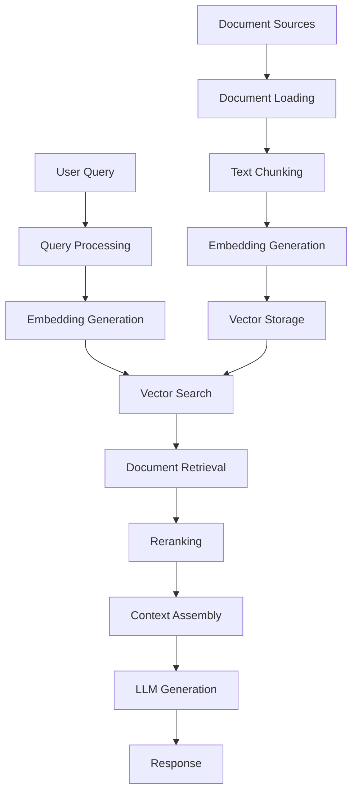
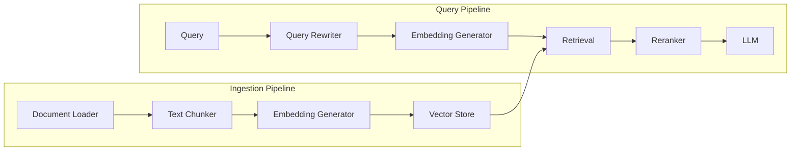

# RAG Implementation Playbook

Complete guide for implementing Retrieval-Augmented Generation (RAG) systems from scratch.

## Table of Contents

1. [Overview](#overview)
2. [Prerequisites](#prerequisites)
3. [Architecture](#architecture)
4. [Vector Database Setup](#vector-database-setup)
5. [Document Ingestion Pipeline](#document-ingestion-pipeline)
6. [Embedding Generation](#embedding-generation)
7. [Query Processing](#query-processing)
8. [Retrieval Pipeline](#retrieval-pipeline)
9. [Response Generation](#response-generation)
10. [Evaluation & Metrics](#evaluation--metrics)
11. [Production Deployment](#production-deployment)
12. [Common Pitfalls](#common-pitfalls)
13. [Troubleshooting](#troubleshooting)

---

## Overview

Retrieval-Augmented Generation (RAG) combines the power of large language models with external knowledge bases to provide accurate, grounded responses. This playbook guides you through implementing a production-ready RAG system.

### What is RAG?

RAG enhances LLM responses by:

1. **Retrieving** relevant documents from a knowledge base
2. **Augmenting** the prompt with retrieved context
3. **Generating** responses grounded in retrieved information

### Use Cases

- Document Q&A systems
- Customer support chatbots
- Knowledge base search
- Technical documentation assistants
- Legal/medical document analysis
- Enterprise knowledge management

### Architecture Diagram



---

## Prerequisites

### Required Skills

- rag-implementer
- knowledge-base-manager

### Required MCPs

- vector-database-mcp
- embedding-generator-mcp
- semantic-search-mcp

### Dependencies

```json
{
  "dependencies": {
    "@pinecone-database/pinecone": "^1.1.0",
    "langchain": "^0.1.0",
    "openai": "^4.20.0",
    "cohere-ai": "^7.0.0",
    "pdf-parse": "^1.1.1",
    "mammoth": "^1.6.0",
    "tiktoken": "^1.0.0",
    "zod": "^3.22.0"
  }
}
```

### Environment Setup

```bash
# Required API keys
export OPENAI_API_KEY="sk-..."
export PINECONE_API_KEY="..."
export PINECONE_ENVIRONMENT="us-west1-gcp"
export COHERE_API_KEY="..."  # Optional, for reranking

# Optional: For local development
export CHROMA_HOST="localhost:8000"
```

---

## Architecture

### System Components



### Key Design Decisions

1. **Vector Database Selection**
   - Pinecone: Managed, scalable, expensive
   - Weaviate: Self-hosted, feature-rich
   - Chroma: Lightweight, local development
   - Qdrant: High performance, Rust-based
   - PgVector: PostgreSQL extension, simple

2. **Embedding Model Selection**
   - OpenAI text-embedding-3-small (1536 dims, $0.02/1M tokens)
   - OpenAI text-embedding-3-large (3072 dims, $0.13/1M tokens)
   - Cohere embed-english-v3.0 (1024 dims, free tier)
   - Local models (sentence-transformers, free)

3. **Chunking Strategy**
   - Fixed-size: Predictable, fast
   - Recursive: Respects structure
   - Semantic: AI-powered boundaries
   - Sentence-based: Natural boundaries
   - Markdown-aware: Preserves headers

---

## Vector Database Setup

### Pinecone Setup

```typescript
import { Pinecone } from '@pinecone-database/pinecone';

// Initialize Pinecone client
const pinecone = new Pinecone({
  apiKey: process.env.PINECONE_API_KEY!,
  environment: process.env.PINECONE_ENVIRONMENT!
});

// Create index
await pinecone.createIndex({
  name: 'documents',
  dimension: 1536, // Match embedding dimension
  metric: 'cosine', // cosine, euclidean, or dotproduct
  spec: {
    serverless: {
      cloud: 'aws',
      region: 'us-west-2'
    }
  }
});

// Get index
const index = pinecone.Index('documents');

// Upsert vectors
await index.upsert([
  {
    id: 'doc1',
    values: [0.1, 0.2, ...], // 1536-dimensional vector
    metadata: {
      text: 'Document content...',
      source: 'file.pdf',
      page: 1
    }
  }
]);

// Query vectors
const results = await index.query({
  vector: [0.1, 0.2, ...],
  topK: 5,
  includeMetadata: true,
  filter: {
    source: { $eq: 'file.pdf' }
  }
});
```

### Weaviate Setup

```typescript
import weaviate, { WeaviateClient } from 'weaviate-ts-client'

// Initialize client
const client: WeaviateClient = weaviate.client({
  scheme: 'http',
  host: 'localhost:8080',
  apiKey: new weaviate.ApiKey(process.env.WEAVIATE_API_KEY!)
})

// Create schema
await client.schema
  .classCreator()
  .withClass({
    class: 'Document',
    description: 'Document chunks for RAG',
    vectorizer: 'text2vec-openai',
    moduleConfig: {
      'text2vec-openai': {
        model: 'text-embedding-3-small',
        modelVersion: '001',
        type: 'text'
      }
    },
    properties: [
      {
        name: 'text',
        dataType: ['text'],
        description: 'Document content'
      },
      {
        name: 'source',
        dataType: ['string'],
        description: 'Source file'
      },
      {
        name: 'page',
        dataType: ['int'],
        description: 'Page number'
      }
    ]
  })
  .do()

// Import data
await client.data
  .creator()
  .withClassName('Document')
  .withProperties({
    text: 'Document content...',
    source: 'file.pdf',
    page: 1
  })
  .do()

// Query
const result = await client.graphql
  .get()
  .withClassName('Document')
  .withFields('text source page _additional { distance }')
  .withNearText({ concepts: ['search query'] })
  .withLimit(5)
  .do()
```

### Chroma Setup (Local)

```typescript
import { ChromaClient } from 'chromadb';

// Initialize client
const client = new ChromaClient({
  path: 'http://localhost:8000'
});

// Create collection
const collection = await client.createCollection({
  name: 'documents',
  metadata: { 'hnsw:space': 'cosine' }
});

// Add documents
await collection.add({
  ids: ['doc1', 'doc2'],
  embeddings: [[0.1, 0.2, ...], [0.3, 0.4, ...]],
  metadatas: [
    { source: 'file1.pdf', page: 1 },
    { source: 'file2.pdf', page: 1 }
  ],
  documents: ['First document...', 'Second document...']
});

// Query
const results = await collection.query({
  queryEmbeddings: [[0.1, 0.2, ...]],
  nResults: 5,
  where: { source: 'file1.pdf' }
});
```

### Using VectorStoreClient Component

```typescript
import {
  VectorStoreClient,
  createVectorStoreClient
} from '../components/rag-pipelines/vector-store-client'

// Create client (auto-detects from environment)
const client = createVectorStoreClient('pinecone', {
  apiKey: process.env.PINECONE_API_KEY,
  environment: 'us-west1-gcp'
})

// Create collection
await client.createCollection('documents', {
  dimension: 1536,
  metric: 'cosine'
})

// Batch upsert with progress
await client.batchUpsert('documents', vectors, {
  batchSize: 100,
  onProgress: (current, total) => {
    console.log(`Upserting: ${current}/${total}`)
  }
})

// Search with filters
const results = await client.search('documents', queryVector, {
  topK: 10,
  scoreThreshold: 0.7,
  filter: {
    category: 'tutorial',
    language: 'en'
  },
  includeMetadata: true
})
```

---

## Document Ingestion Pipeline

### Document Loading

```typescript
import { DocumentLoader } from '../components/rag-pipelines/document-loader'

// Initialize loader
const loader = new DocumentLoader({
  maxFileSize: 10 * 1024 * 1024, // 10MB
  supportedFormats: ['txt', 'md', 'html', 'json', 'csv', 'pdf', 'docx'],
  concurrency: 5,
  retries: 3
})

// Load from files
const documents = await loader.loadFromFiles([
  './docs/guide.md',
  './docs/api.pdf',
  './docs/tutorial.docx'
])

// Load from directory
const allDocs = await loader.loadFromDirectory('./docs', {
  recursive: true,
  extensions: ['md', 'pdf'],
  ignore: ['node_modules', '.git']
})

// Load from URLs
const webDocs = await loader.loadFromUrls([
  'https://example.com/docs/page1.html',
  'https://example.com/docs/page2.html'
])

// Custom loader for specific format
const customDocs = await loader.loadCustom([
  {
    path: './data/custom.json',
    parser: async content => {
      const data = JSON.parse(content)
      return data.articles.map(article => ({
        content: article.body,
        metadata: {
          title: article.title,
          author: article.author,
          date: article.publishedAt
        }
      }))
    }
  }
])

console.log(`Loaded ${documents.length} documents`)
documents.forEach(doc => {
  console.log(`- ${doc.metadata.source}: ${doc.content.length} chars`)
})
```

### Text Chunking

```typescript
import { TextChunker, ChunkingUtils } from '../components/rag-pipelines/text-chunker'

// Analyze document to get recommendations
const analysis = ChunkingUtils.analyzeText(document.content)
console.log('Recommended strategy:', analysis.strategy)
console.log('Recommended chunk size:', analysis.recommendedChunkSize)
console.log('Document stats:', analysis.stats)

// Create chunker with recommended settings
const chunker = new TextChunker({
  chunkSize: analysis.recommendedChunkSize,
  chunkOverlap: analysis.recommendedOverlap,
  strategy: analysis.strategy,
  tokenizer: 'tiktoken', // or 'simple', 'recursive'
  preserveContext: true
})

// Chunk the text
const chunks = await chunker.chunkText(document.content, {
  metadata: document.metadata
})

// Validate chunks
chunks.forEach((chunk, i) => {
  const validation = ChunkingUtils.validateChunk(chunk)
  if (!validation.valid) {
    console.warn(`Chunk ${i} has issues:`, validation.issues)
    console.warn(`Quality score: ${validation.score}/100`)
  }
})

// Merge small chunks
const mergedChunks = ChunkingUtils.mergeSmallChunks(chunks, 100)

console.log(`Created ${chunks.length} chunks`)
console.log(`After merging: ${mergedChunks.length} chunks`)
```

### Advanced Chunking Strategies

```typescript
// Fixed-size chunking (fast, predictable)
const fixedChunker = new TextChunker({
  strategy: 'fixed',
  chunkSize: 1000,
  chunkOverlap: 200
})

// Recursive chunking (respects structure)
const recursiveChunker = new TextChunker({
  strategy: 'recursive',
  chunkSize: 1000,
  chunkOverlap: 200,
  separators: ['\n\n', '\n', '. ', ' ']
})

// Semantic chunking (AI-powered)
const semanticChunker = new TextChunker({
  strategy: 'semantic',
  chunkSize: 1000,
  embeddingModel: 'text-embedding-3-small',
  similarityThreshold: 0.8
})

// Sentence-based chunking
const sentenceChunker = new TextChunker({
  strategy: 'sentence',
  chunkSize: 1000,
  chunkOverlap: 200
})

// Markdown-aware chunking
const markdownChunker = new TextChunker({
  strategy: 'markdown',
  chunkSize: 1000,
  chunkOverlap: 200,
  preserveHeaders: true
})
```

---

## Embedding Generation

### OpenAI Embeddings

```typescript
import { EmbeddingPipeline } from '../components/rag-pipelines/embedding-pipeline'

// Create embedding pipeline
const pipeline = new EmbeddingPipeline({
  provider: 'openai',
  model: 'text-embedding-3-small',
  apiKey: process.env.OPENAI_API_KEY,
  batchSize: 100,
  cache: true,
  onProgress: ({ current, total, stage }) => {
    console.log(`${stage}: ${current}/${total}`)
  }
})

// Embed single text
const queryEmbedding = await pipeline.embedText('What is RAG?')
console.log('Embedding dimensions:', queryEmbedding.length)

// Embed documents in batch
const embeddings = await pipeline.embedDocuments(chunks.map(c => c.content))

console.log(`Generated ${embeddings.length} embeddings`)
console.log(`Cache hit rate: ${pipeline.getCacheStats().hitRate}%`)
```

### Multi-Provider Support

```typescript
// Cohere embeddings
const cohereEmbeddings = new EmbeddingPipeline({
  provider: 'cohere',
  model: 'embed-english-v3.0',
  apiKey: process.env.COHERE_API_KEY,
  inputType: 'search_document' // or 'search_query'
})

// HuggingFace embeddings (local)
const hfEmbeddings = new EmbeddingPipeline({
  provider: 'huggingface',
  model: 'sentence-transformers/all-MiniLM-L6-v2',
  device: 'cpu' // or 'cuda'
})
```

### Advanced Embedding Features

```typescript
import {
  SimilarityCalculator,
  EmbeddingCacheManager
} from '../components/rag-pipelines/embedding-pipeline'

// Compute similarity matrix
const vectors = embeddings.map(e => e.embedding)
const similarityMatrix = SimilarityCalculator.computeSimilarityMatrix(vectors)

// Find most similar documents
const similar = SimilarityCalculator.findMostSimilar(
  queryEmbedding,
  vectors,
  5 // top K
)

console.log('Most similar documents:', similar)

// Cluster documents
const clusters = SimilarityCalculator.clusterVectors(vectors, 3)
console.log('Document clusters:', clusters)

// Advanced cache management
const cacheManager = new EmbeddingCacheManager(
  10000, // max size
  7 * 24 * 60 * 60 * 1000 // 7 days TTL
)

// Use cache
const cached = cacheManager.get('some text')
if (!cached) {
  const embedding = await pipeline.embedText('some text')
  cacheManager.set('some text', embedding)
}

// Export/import cache
const cacheJson = cacheManager.export()
fs.writeFileSync('cache.json', JSON.stringify(cacheJson))

// Later...
const loadedCache = JSON.parse(fs.readFileSync('cache.json', 'utf-8'))
cacheManager.import(loadedCache)

// Clean expired entries
const cleaned = cacheManager.cleanExpired()
console.log(`Cleaned ${cleaned} expired entries`)
```

---

## Query Processing

### Query Rewriting

```typescript
import { QueryRewriter } from '../components/rag-pipelines/retrieval-pipeline'

const originalQuery = 'How to implement authentication?'

// Expand with synonyms
const expandedQueries = QueryRewriter.expandWithSynonyms(originalQuery)
console.log('Expanded queries:', expandedQueries)
// Output: [
//   'How to implement authentication?',
//   'How to implement auth?',
//   'How to implement login?',
//   'How to implement user verification?'
// ]

// Decompose complex query
const decomposed = QueryRewriter.decomposeQuery(
  'What are the security implications of OAuth 2.0 and how do I implement it in Node.js?'
)
console.log('Decomposed queries:', decomposed)
// Output: [
//   'What are the security implications of OAuth 2.0?',
//   'How do I implement OAuth 2.0 in Node.js?'
// ]

// Simplify query (remove stop words)
const simplified = QueryRewriter.simplifyQuery(originalQuery)
console.log('Simplified query:', simplified)
// Output: 'implement authentication'

// HyDE (Hypothetical Document Embeddings)
const hypotheticalDoc = await QueryRewriter.generateHypotheticalDocument(originalQuery, llm)
console.log('Hypothetical document:', hypotheticalDoc)
// Output: 'To implement authentication, you need to...'
```

### Query Expansion with LLM

```typescript
import OpenAI from 'openai'

const openai = new OpenAI({
  apiKey: process.env.OPENAI_API_KEY
})

async function expandQuery(query: string): Promise<string[]> {
  const response = await openai.chat.completions.create({
    model: 'gpt-3.5-turbo',
    messages: [
      {
        role: 'system',
        content:
          'Generate 3 alternative phrasings of the user query that preserve the same meaning.'
      },
      {
        role: 'user',
        content: query
      }
    ],
    temperature: 0.7
  })

  const alternatives = response.choices[0].message.content!.split('\n').filter(Boolean)
  return [query, ...alternatives]
}

const expandedQueries = await expandQuery('How to secure an API?')
console.log(expandedQueries)
```

---

## Retrieval Pipeline

### Basic Retrieval

```typescript
import { RetrievalPipeline } from '../components/rag-pipelines/retrieval-pipeline'

// Create retrieval pipeline
const retrieval = new RetrievalPipeline({
  vectorStore: client,
  searchType: 'hybrid', // 'vector', 'keyword', or 'hybrid'
  topK: 20,
  rerank: true,
  fusionMethod: 'rrf', // 'rrf', 'weighted', or 'max'
  scoreThreshold: 0.7
})

// Retrieve documents
const results = await retrieval.retrieve('What is RAG?')

console.log(`Found ${results.documents.length} documents`)
results.documents.forEach((doc, i) => {
  console.log(`${i + 1}. Score: ${results.scores[i]}`)
  console.log(`   Source: ${doc.metadata.source}`)
  console.log(`   Preview: ${doc.pageContent.substring(0, 100)}...`)
})
```

### Advanced Retrieval with Reranking

```typescript
import { ResultReranker } from '../components/rag-pipelines/retrieval-pipeline'

// Retrieve initial results
let results = await retrieval.retrieve(query, { topK: 20 })

// Rerank by keywords
const keywordReranked = ResultReranker.rerankByKeywords(
  query,
  results.documents.map((doc, i) => [doc, results.scores[i]])
)

// Rerank by metadata (prefer recent documents)
const metadataReranked = ResultReranker.rerankByMetadata(keywordReranked, { category: 'tutorial' })

// Rerank by recency
const recencyReranked = ResultReranker.rerankByRecency(
  metadataReranked,
  0.3 // 30% weight on recency
)

// Apply diversity (MMR)
const diverseResults = ResultReranker.rerankByDiversity(
  recencyReranked,
  0.7 // Balance: 70% relevance, 30% diversity
)

// Extract final documents
const finalDocuments = diverseResults.map(([doc]) => doc)
```

### Hybrid Search Implementation

```typescript
async function hybridSearch(query: string, vectorStore: VectorStoreClient, topK: number = 10) {
  // 1. Vector search
  const queryEmbedding = await pipeline.embedText(query)
  const vectorResults = await vectorStore.search('documents', queryEmbedding, {
    topK: topK * 2 // Retrieve more for fusion
  })

  // 2. Keyword search (BM25)
  const keywordResults = await performKeywordSearch(query, topK * 2)

  // 3. Fusion using Reciprocal Rank Fusion (RRF)
  const fused = fuseResults(vectorResults, keywordResults, 'rrf')

  // 4. Return top K
  return fused.slice(0, topK)
}

function fuseResults(
  vectorResults: any[],
  keywordResults: any[],
  method: 'rrf' | 'weighted' | 'max'
): any[] {
  if (method === 'rrf') {
    const k = 60 // RRF constant
    const scores = new Map<string, number>()

    vectorResults.forEach((doc, rank) => {
      const id = doc.id
      scores.set(id, (scores.get(id) || 0) + 1 / (k + rank + 1))
    })

    keywordResults.forEach((doc, rank) => {
      const id = doc.id
      scores.set(id, (scores.get(id) || 0) + 1 / (k + rank + 1))
    })

    return Array.from(scores.entries())
      .sort((a, b) => b[1] - a[1])
      .map(([id, score]) => ({ id, score }))
  }

  // Implement other fusion methods...
  throw new Error(`Fusion method ${method} not implemented`)
}
```

---

## Response Generation

### Basic Generation with Context

```typescript
import OpenAI from 'openai'

const openai = new OpenAI({
  apiKey: process.env.OPENAI_API_KEY
})

async function generateResponse(query: string, context: string[]): Promise<string> {
  const contextText = context.map((doc, i) => `[${i + 1}] ${doc}`).join('\n\n')

  const response = await openai.chat.completions.create({
    model: 'gpt-4-turbo-preview',
    messages: [
      {
        role: 'system',
        content: `You are a helpful assistant. Answer the user's question based ONLY on the provided context. If the answer is not in the context, say "I don't have enough information to answer that question."`
      },
      {
        role: 'user',
        content: `Context:\n${contextText}\n\nQuestion: ${query}`
      }
    ],
    temperature: 0.7,
    max_tokens: 500
  })

  return response.choices[0].message.content!
}

// Usage
const retrievedDocs = results.documents.map(doc => doc.pageContent)
const answer = await generateResponse(query, retrievedDocs)
console.log('Answer:', answer)
```

### Advanced Generation with Citations

```typescript
async function generateResponseWithCitations(
  query: string,
  documents: Array<{ content: string; source: string; page?: number }>
): Promise<{ answer: string; citations: string[] }> {
  const contextText = documents
    .map(
      (doc, i) =>
        `[${i + 1}] (Source: ${doc.source}${doc.page ? `, Page: ${doc.page}` : ''})\n${doc.content}`
    )
    .join('\n\n')

  const response = await openai.chat.completions.create({
    model: 'gpt-4-turbo-preview',
    messages: [
      {
        role: 'system',
        content: `You are a helpful assistant. Answer the user's question based on the provided context.
        Include citations using [1], [2], etc. to reference the source documents.
        If the answer is not in the context, say "I don't have enough information to answer that question."`
      },
      {
        role: 'user',
        content: `Context:\n${contextText}\n\nQuestion: ${query}`
      }
    ],
    temperature: 0.7,
    max_tokens: 500
  })

  const answer = response.choices[0].message.content!

  // Extract citations
  const citationRegex = /\[(\d+)\]/g
  const citationMatches = answer.matchAll(citationRegex)
  const citationIndices = new Set(Array.from(citationMatches).map(match => parseInt(match[1]) - 1))

  const citations = Array.from(citationIndices)
    .map(
      i =>
        `[${i + 1}] ${documents[i].source}${documents[i].page ? ` (Page ${documents[i].page})` : ''}`
    )
    .sort()

  return { answer, citations }
}

// Usage
const { answer, citations } = await generateResponseWithCitations(query, results.documents)
console.log('Answer:', answer)
console.log('\nCitations:')
citations.forEach(citation => console.log(citation))
```

### Streaming Responses

```typescript
async function generateStreamingResponse(
  query: string,
  context: string[]
): Promise<AsyncIterable<string>> {
  const contextText = context.map((doc, i) => `[${i + 1}] ${doc}`).join('\n\n')

  const stream = await openai.chat.completions.create({
    model: 'gpt-4-turbo-preview',
    messages: [
      {
        role: 'system',
        content: 'You are a helpful assistant. Answer based ONLY on the provided context.'
      },
      {
        role: 'user',
        content: `Context:\n${contextText}\n\nQuestion: ${query}`
      }
    ],
    stream: true
  })

  return stream
}

// Usage
const stream = await generateStreamingResponse(query, retrievedDocs)
for await (const chunk of stream) {
  const content = chunk.choices[0]?.delta?.content || ''
  process.stdout.write(content)
}
```

---

## Evaluation & Metrics

### Retrieval Metrics

```typescript
import { RetrievalMetrics } from '../components/rag-pipelines/retrieval-pipeline'

// Ground truth: relevant document IDs
const relevantDocs = ['doc1', 'doc2', 'doc3']

// Retrieved document IDs
const retrievedIds = results.documents.map(d => d.metadata.id)

// Precision@K
const precision5 = RetrievalMetrics.precisionAtK(retrievedIds, relevantDocs, 5)
const precision10 = RetrievalMetrics.precisionAtK(retrievedIds, relevantDocs, 10)

console.log(`Precision@5: ${precision5.toFixed(3)}`)
console.log(`Precision@10: ${precision10.toFixed(3)}`)

// Recall@K
const recall5 = RetrievalMetrics.recallAtK(retrievedIds, relevantDocs, 5)
const recall10 = RetrievalMetrics.recallAtK(retrievedIds, relevantDocs, 10)

console.log(`Recall@5: ${recall5.toFixed(3)}`)
console.log(`Recall@10: ${recall10.toFixed(3)}`)

// Mean Reciprocal Rank (MRR)
const mrr = RetrievalMetrics.meanReciprocalRank(retrievedIds, relevantDocs)
console.log(`MRR: ${mrr.toFixed(3)}`)

// NDCG@K (with relevance scores)
const relevanceScores = new Map([
  ['doc1', 3], // Highly relevant
  ['doc2', 2], // Relevant
  ['doc3', 1] // Somewhat relevant
])

const ndcg5 = RetrievalMetrics.ndcgAtK(retrievedIds, relevanceScores, 5)
const ndcg10 = RetrievalMetrics.ndcgAtK(retrievedIds, relevanceScores, 10)

console.log(`NDCG@5: ${ndcg5.toFixed(3)}`)
console.log(`NDCG@10: ${ndcg10.toFixed(3)}`)
```

### Generation Metrics

```typescript
// ROUGE scores (for summarization)
import * as rouge from 'rouge'

function calculateRouge(reference: string, generated: string) {
  const scores = rouge.n(reference, generated, { n: 2 })
  return {
    rouge1: scores.rouge1,
    rouge2: scores.rouge2,
    rougeL: scores.rougeL
  }
}

// Faithfulness check (is response grounded in context?)
async function checkFaithfulness(answer: string, context: string[]): Promise<number> {
  const contextText = context.join('\n')

  const response = await openai.chat.completions.create({
    model: 'gpt-4-turbo-preview',
    messages: [
      {
        role: 'system',
        content:
          'Rate how well the answer is supported by the context. Return only a number from 0 (not supported) to 10 (fully supported).'
      },
      {
        role: 'user',
        content: `Context:\n${contextText}\n\nAnswer: ${answer}`
      }
    ],
    temperature: 0
  })

  return parseFloat(response.choices[0].message.content!)
}

// Relevance check (does answer address the query?)
async function checkRelevance(query: string, answer: string): Promise<number> {
  const response = await openai.chat.completions.create({
    model: 'gpt-4-turbo-preview',
    messages: [
      {
        role: 'system',
        content:
          'Rate how well the answer addresses the query. Return only a number from 0 (irrelevant) to 10 (perfectly relevant).'
      },
      {
        role: 'user',
        content: `Query: ${query}\n\nAnswer: ${answer}`
      }
    ],
    temperature: 0
  })

  return parseFloat(response.choices[0].message.content!)
}
```

### End-to-End Evaluation

```typescript
interface EvaluationResult {
  query: string
  answer: string
  precision: number
  recall: number
  faithfulness: number
  relevance: number
  latency: number
}

async function evaluateRAG(
  testQueries: Array<{ query: string; relevantDocs: string[] }>,
  rag: RAGOrchestrator
): Promise<EvaluationResult[]> {
  const results: EvaluationResult[] = []

  for (const { query, relevantDocs } of testQueries) {
    const startTime = Date.now()

    // Run query
    const result = await rag.query(query)
    const retrievedIds = result.documents.map(d => d.metadata.id)
    const answer = await generateResponse(
      query,
      result.documents.map(d => d.pageContent)
    )

    const latency = Date.now() - startTime

    // Calculate metrics
    const precision = RetrievalMetrics.precisionAtK(retrievedIds, relevantDocs, 5)
    const recall = RetrievalMetrics.recallAtK(retrievedIds, relevantDocs, 5)
    const faithfulness = await checkFaithfulness(
      answer,
      result.documents.map(d => d.pageContent)
    )
    const relevance = await checkRelevance(query, answer)

    results.push({
      query,
      answer,
      precision,
      recall,
      faithfulness,
      relevance,
      latency
    })
  }

  return results
}

// Run evaluation
const testQueries = [
  { query: 'What is RAG?', relevantDocs: ['doc1', 'doc2'] },
  { query: 'How to implement embeddings?', relevantDocs: ['doc3', 'doc4'] }
]

const evalResults = await evaluateRAG(testQueries, rag)

// Calculate averages
const avgPrecision = evalResults.reduce((sum, r) => sum + r.precision, 0) / evalResults.length
const avgRecall = evalResults.reduce((sum, r) => sum + r.recall, 0) / evalResults.length
const avgFaithfulness = evalResults.reduce((sum, r) => sum + r.faithfulness, 0) / evalResults.length
const avgRelevance = evalResults.reduce((sum, r) => sum + r.relevance, 0) / evalResults.length
const avgLatency = evalResults.reduce((sum, r) => sum + r.latency, 0) / evalResults.length

console.log('Evaluation Results:')
console.log(`Average Precision@5: ${avgPrecision.toFixed(3)}`)
console.log(`Average Recall@5: ${avgRecall.toFixed(3)}`)
console.log(`Average Faithfulness: ${avgFaithfulness.toFixed(1)}/10`)
console.log(`Average Relevance: ${avgRelevance.toFixed(1)}/10`)
console.log(`Average Latency: ${avgLatency.toFixed(0)}ms`)
```

---

## Production Deployment

### Complete RAG Orchestrator

```typescript
import { RAGOrchestrator } from '../components/rag-pipelines/rag-orchestrator'

// Initialize orchestrator
const rag = new RAGOrchestrator({
  vectorStore: client,
  embeddingProvider: 'openai',
  embeddingModel: 'text-embedding-3-small',
  chunkSize: 1000,
  chunkOverlap: 200,
  searchType: 'hybrid',
  rerank: true,
  onProgress: progress => {
    console.log(`${progress.stage}: ${progress.current}/${progress.total}`)
  }
})

// Index documents
const indexResult = await rag.indexDocuments([
  { path: './docs/guide.md', type: 'md' },
  { path: './docs/api.pdf', type: 'pdf' }
])

console.log(`Indexed ${indexResult.chunksCreated} chunks in ${indexResult.timeMs}ms`)

// Query
const queryResult = await rag.query('What is RAG?', {
  topK: 5,
  rerank: true,
  scoreThreshold: 0.7
})

console.log(`Found ${queryResult.documents.length} relevant documents`)
```

### Monitoring with RAGMonitor

```typescript
import { RAGMonitor } from '../components/rag-pipelines/rag-orchestrator'

const monitor = new RAGMonitor()

// Record queries
const startTime = Date.now()
const result = await rag.query('test query')
const executionTime = Date.now() - startTime
monitor.recordQuery(executionTime, false)

// Record errors
try {
  await rag.query('bad query')
} catch (error) {
  monitor.recordError(error.message)
}

// Get metrics
const metrics = monitor.getMetrics()
console.log('Query metrics:', {
  queryCount: metrics.queryCount,
  avgQueryTime: metrics.avgQueryTime,
  cacheHitRate: metrics.cacheHitRate,
  errorCount: metrics.errors.length
})

// Export for analysis
const metricsJson = monitor.exportMetrics()
fs.writeFileSync('metrics.json', JSON.stringify(metricsJson, null, 2))
```

### Docker Deployment

```dockerfile
# Dockerfile
FROM node:18-alpine

WORKDIR /app

# Install dependencies
COPY package*.json ./
RUN npm ci --production

# Copy application
COPY . .

# Build TypeScript
RUN npm run build

# Expose port
EXPOSE 3000

# Start application
CMD ["node", "dist/index.js"]
```

```yaml
# docker-compose.yml
version: '3.8'

services:
  rag-api:
    build: .
    ports:
      - '3000:3000'
    environment:
      - OPENAI_API_KEY=${OPENAI_API_KEY}
      - PINECONE_API_KEY=${PINECONE_API_KEY}
      - PINECONE_ENVIRONMENT=${PINECONE_ENVIRONMENT}
      - NODE_ENV=production
    volumes:
      - ./data:/app/data
    restart: unless-stopped

  chroma:
    image: chromadb/chroma:latest
    ports:
      - '8000:8000'
    volumes:
      - chroma-data:/chroma/chroma
    restart: unless-stopped

volumes:
  chroma-data:
```

### API Server

```typescript
import express from 'express'

const app = express()
app.use(express.json())

// Initialize RAG
const rag = new RAGOrchestrator({
  /* config */
})
await rag.indexDocuments(/* sources */)

// Query endpoint
app.post('/query', async (req, res) => {
  try {
    const { query, topK = 5 } = req.body

    if (!query) {
      return res.status(400).json({ error: 'Query is required' })
    }

    const startTime = Date.now()
    const result = await rag.query(query, { topK })
    const latency = Date.now() - startTime

    const answer = await generateResponse(
      query,
      result.documents.map(d => d.pageContent)
    )

    res.json({
      answer,
      documents: result.documents.map(d => ({
        content: d.pageContent,
        source: d.metadata.source,
        score: d.metadata.score
      })),
      latency
    })
  } catch (error) {
    console.error('Query error:', error)
    res.status(500).json({ error: 'Internal server error' })
  }
})

// Health check
app.get('/health', (req, res) => {
  res.json({ status: 'healthy' })
})

const PORT = process.env.PORT || 3000
app.listen(PORT, () => {
  console.log(`RAG API running on port ${PORT}`)
})
```

---

## Common Pitfalls

### 1. Chunking Too Large or Too Small

**Problem**: Chunks that are too large lose semantic focus; chunks that are too small lack context.

**Solution**: Use `ChunkingUtils.analyzeText()` to get recommendations. Typical sizes: 500-1500 tokens.

```typescript
const analysis = ChunkingUtils.analyzeText(document)
const chunker = new TextChunker({
  chunkSize: analysis.recommendedChunkSize,
  chunkOverlap: analysis.recommendedOverlap
})
```

### 2. Not Using Overlap

**Problem**: Important information split across chunk boundaries.

**Solution**: Use 10-20% overlap between chunks.

```typescript
const chunker = new TextChunker({
  chunkSize: 1000,
  chunkOverlap: 200 // 20% overlap
})
```

### 3. Ignoring Metadata

**Problem**: Retrieved documents lack context for filtering and ranking.

**Solution**: Include rich metadata during indexing.

```typescript
await vectorStore.upsert([
  {
    id: 'doc1',
    values: embedding,
    metadata: {
      text: 'Document content',
      source: 'guide.pdf',
      page: 1,
      category: 'tutorial',
      language: 'en',
      date: '2024-01-01',
      author: 'John Doe'
    }
  }
])
```

### 4. Not Reranking Results

**Problem**: Initial vector search may not capture semantic relevance accurately.

**Solution**: Always rerank top results.

```typescript
const retrieval = new RetrievalPipeline({
  vectorStore,
  rerank: true,
  topK: 20 // Retrieve more for reranking
})
```

### 5. Poor Query Quality

**Problem**: User queries are often vague or poorly phrased.

**Solution**: Implement query rewriting and expansion.

```typescript
const expandedQueries = QueryRewriter.expandWithSynonyms(query)
const simplified = QueryRewriter.simplifyQuery(query)
```

### 6. No Caching

**Problem**: Repeated queries waste API calls and time.

**Solution**: Enable caching at multiple levels.

```typescript
// Embedding cache
const pipeline = new EmbeddingPipeline({
  provider: 'openai',
  cache: true
})

// Tool cache
const toolHandler = new MCPToolHandler({
  cache: { enabled: true, ttl: 300000 }
})
```

### 7. Ignoring Evaluation

**Problem**: No way to measure system performance or improvements.

**Solution**: Implement comprehensive evaluation.

```typescript
const evalResults = await evaluateRAG(testQueries, rag)
console.log('Average Precision:', avgPrecision)
```

---

## Troubleshooting

### Issue: Low Retrieval Accuracy

**Symptoms**: Irrelevant documents returned for queries.

**Diagnosis**:

```typescript
// Check embedding quality
const queryEmbedding = await pipeline.embedText(query)
console.log('Embedding dimensions:', queryEmbedding.length)

// Check vector search results
const results = await vectorStore.search('documents', queryEmbedding, {
  topK: 10,
  includeMetadata: true
})

console.log('Top results:')
results.forEach((r, i) => {
  console.log(`${i + 1}. Score: ${r.score}, Source: ${r.metadata.source}`)
})
```

**Solutions**:

1. Improve chunking strategy
2. Use hybrid search instead of pure vector search
3. Implement query rewriting
4. Add metadata filters
5. Use reranking

### Issue: Slow Query Performance

**Symptoms**: Queries take >2 seconds.

**Diagnosis**:

```typescript
const startTime = Date.now()
const result = await rag.query(query)
console.log('Query time:', Date.now() - startTime, 'ms')
```

**Solutions**:

1. Enable caching
2. Reduce `topK` value
3. Use approximate nearest neighbor search
4. Optimize vector database configuration
5. Use smaller embedding model
6. Implement request batching

### Issue: Out of Memory

**Symptoms**: Application crashes with OOM errors.

**Diagnosis**:

```typescript
console.log('Memory usage:', process.memoryUsage())
```

**Solutions**:

1. Batch document processing
2. Stream large files
3. Clear cache periodically
4. Reduce chunk overlap
5. Use pagination for large result sets

### Issue: Poor Answer Quality

**Symptoms**: LLM generates incorrect or hallucinated answers.

**Diagnosis**:

```typescript
const faithfulness = await checkFaithfulness(answer, context)
console.log('Faithfulness score:', faithfulness)
```

**Solutions**:

1. Improve retrieval accuracy
2. Add explicit instructions in system prompt
3. Increase context window
4. Use citation-based generation
5. Implement answer validation

### Issue: High API Costs

**Symptoms**: Unexpected high costs for embeddings/LLM.

**Diagnosis**:

```typescript
const metrics = monitor.getMetrics()
console.log('API calls:', metrics.queryCount)
console.log('Cache hit rate:', metrics.cacheHitRate)
```

**Solutions**:

1. Enable aggressive caching
2. Use smaller/cheaper models
3. Implement rate limiting
4. Batch API calls
5. Use local embeddings for development

---

## Related Resources

### Skills

- rag-implementer
- knowledge-base-manager
- semantic-search

### MCPs

- vector-database-mcp
- embedding-generator-mcp
- semantic-search-mcp
- knowledge-base-mcp

### Components

- `/components/rag-pipelines/` - All RAG components
- `/components/workflows/` - Workflow orchestration
- `/tools/langchain-tools/` - LangChain integration tools

### Further Reading

- [LangChain RAG Docs](https://python.langchain.com/docs/use_cases/question_answering/)
- [Pinecone RAG Guide](https://www.pinecone.io/learn/rag/)
- [OpenAI Embeddings Best Practices](https://platform.openai.com/docs/guides/embeddings)
- [Cohere Reranking](https://docs.cohere.com/docs/reranking)

---

**Last Updated**: 2025-10-27
**Version**: 1.0.0
